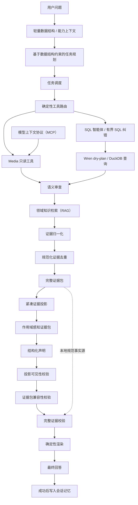

# DataPilot-Media

## 项目简介

DataPilot-Media 是一个面向音视频质量分析与故障排查场景的多步分析智能体（AI Agent）。

项目基于 DataPilot 通用智能体运行框架与 WrenAI 语义层构建，通过任务规划、工具调用（Tool Calling）、检索增强生成（RAG）、模型上下文协议（MCP）、语义审查器（Semantic Reviewer）以及证据约束机制，将播放质量指标、告警、日志和领域知识组织成可验证的分析流程。

与直接让大语言模型（LLM）自由生成答案不同，本项目重点处理多步智能体中的以下工程问题：

- 模型如何理解真实数据结构，避免规划不存在的查询实体、指标和维度；
- 如何在领域工具与 SQL 查询之间进行受控切换；
- 如何把指标、告警、日志和知识统一组织成可追踪证据；
- 如何控制长上下文，避免证据重复与上下文超限；
- 如何避免把时间相关性错误表述为已经证明的因果关系；
- 如何通过结构化声明、证据校验和确定性渲染提高最终回答的事实可靠性。

> 项目状态：已完成实验性原型。当前结果基于确定性合成 Media 数据、小规模离线评测和有限次数的真实模型验证，不代表生产环境准确率，也不应被视为生产级监控平台。

## 核心能力

- **受数据结构约束的规划**：基于数据结构约束的任务规划（Schema-Grounded Planning）在拆解任务前读取轻量模型、字段、指标、关系和领域能力上下文，降低维度编造风险。
- **受控的数据访问**：确定性工具路由器（Deterministic Tool Router）优先匹配 4 个音视频领域只读工具；无法安全匹配时再进入 SQL 智能体（SQL Agent），并保留有界 SQL 纠错（Bounded SQL Correction）。
- **统一工具协议**：同一套参数校验、返回结构和只读边界可通过进程内调用或模型上下文协议服务（MCP Server）使用。
- **领域知识检索**：RAG 支持标题感知切块、BM25、混合检索（Hybrid Retrieval）、倒数排名融合（Reciprocal Rank Fusion，RRF）与重排序（Rerank）。
- **可靠指标对比**：显式绑定主指标、单位、聚合语义和时间窗口角色，并将单任务或跨任务的基线/当前窗口结果归一化为一致的对比证据。
- **证据治理**：使用规范化证据去重（Canonical Evidence Deduplication）、证据来源追踪（Provenance）和冲突时失败即关闭（Fail-Closed），避免重复事实或不兼容作用域被混合使用。
- **分层上下文**：完整证据包（Full Evidence Pack）保留在本地；模型只接收预算内的紧凑证据投影（Compact Evidence Projection）与作用域感知证据包（Scope-Aware Bundle）。
- **受约束的结论生成**：LLM 输出结构化声明（Typed Structured Claims），随后经过投影可见性、证据包兼容性、数值、因果、作用域等校验。
- **确定性回答与记忆**：确定性渲染器（Deterministic Renderer）只渲染已验证事实；会话记忆（Session Memory）仅在整条链路成功后写入。

## 系统架构



DataPilot 原有的任务规划器（Planner）→ 任务调度器（Task Dispatcher）→ SQL 智能体（SQL Agent）→ 语义审查器（Reviewer）→ 分析器（Analyst）→ 最终回答（Final Answer）→ 会话记忆（Session Memory）工作流及其职责边界保持不变。Media 扩展提供领域数据、知识、工具和证据约束能力，不让任务规划器生成 SQL，也不绕过语义审查器门禁。

## 一次完整分析流程

以“华南播放成功率下降并出现 E302，结合告警、日志和知识库分析原因，并给出排查建议”为例：

1. 系统先读取当前 Media 项目的轻量数据结构和能力上下文。
2. 任务规划器将问题拆解为既有的 `query`、`analysis`、`response` 三类任务，并绑定主指标与时间窗口角色。
3. 任务调度器按依赖关系执行任务；确定性路由器根据任务语义选择领域工具或 SQL 智能体。
4. Media 工具返回播放质量、告警、日志或转码状态；SQL 路径通过 WrenAI 执行 `dry-plan` 后查询 DuckDB。
5. 语义审查器独立检查指标、窗口、过滤条件、聚合方式和证据作用域；必要时只触发既定上限内的 SQL 纠错，且不会覆盖已有合法工具证据。
6. RAG 最多返回 5 个相关知识片段，用于补充指标定义、错误码含义和排障 SOP。
7. 证据构建器（Evidence Builder）归一化基线/当前窗口，对跨任务结果进行配对，并保留来源任务和作用域。
8. 系统执行证据去重；若同一规范事实出现冲突，则失败即关闭，而不是静默选择任一结果。
9. 完整证据包作为本地事实依据，确定性压缩后形成紧凑证据投影和作用域感知证据包。
10. 最终声明阶段的 LLM 只能选择可见证据和合法的作用域感知证据包，并为每条声明标注类型、谓词、极性及证据 ID。
11. 校验器先检查投影可见性与证据包兼容性，再使用本地完整证据包完成最终事实校验。
12. 确定性渲染器生成回答；只有所有任务成功且回答通过校验后，才提交会话记忆。

## Media 领域能力

`domains/media/` 提供 4 个确定性合成数据模型：

| 模型 | 主要内容 | 分析用途 |
|---|---|---|
| `stream_sessions` | 播放会话、启动耗时、缓冲时长、播放成功状态 | QoE 指标与区域/CDN 对比 |
| `alarm_events` | 错误码、级别、状态和告警消息 | 同期告警关联与状态分布 |
| `log_events` | CDN、源站、超时等结构化日志 | 故障现象与链路线索分析 |
| `transcode_jobs` | 转码任务状态与错误信息 | 转码链路排查 |

数据覆盖 `prior_year`、`previous_day`、`previous_window` 和 `current_window` 等时间窗口，可支持同比、环比与多基线对比。预设异常场景为华南地区 CDN-B 播放成功率显著下降，并在同期出现 3 条高等级 E302 告警，其状态分别为 `open`、`investigating` 和 `resolved`。

比较证据会明确记录：

- 主指标、单位和聚合语义；
- 区域、CDN 等分组维度与过滤条件；
- 基线窗口、当前窗口及其来源任务；
- 每组 `baseline`、`current`、`delta`；
- 是否存在唯一主基线，以及多基线之间是否可安全比较。

`session_count`、`successful_sessions` 和 `failed_sessions` 仅作为计算、校验和解释字段，不会与 `playback_success_rate` 竞争主指标身份。

## 工具调用与模型上下文协议（MCP）

Media 领域提供 4 个只读工具：

| 工具 | 作用 |
|---|---|
| `query_qoe_metrics` | 按区域、CDN 和时间窗口聚合播放成功率等 QoE 指标 |
| `get_alarm_events` | 查询告警事件，并生成确定性的状态分布与有界样本 |
| `query_logs` | 查询与指定区域、CDN、错误码或时间窗口一致的结构化日志 |
| `get_transcode_status` | 查询转码任务状态和错误信息 |

确定性工具路由器根据任务描述、已绑定指标、窗口角色和工具能力执行受控的语义路由（Semantic Routing）。参数不完整、作用域不兼容或工具无法表达任务时，路由器不会猜测，而是退回既有 SQL 路径。

模型上下文协议服务通过 stdio 暴露相同的工具契约。进程内调用与 MCP 调用共享参数校验、只读执行和结构化结果，因此不会形成两套行为不一致的工具实现。MCP 服务本身不需要接收模型 API 凭据。

## 检索增强生成（RAG）

Media 知识库当前包含 14 篇文档、86 个 Chunk，覆盖 QoE 指标定义、E302 等错误码、CDN 排障 SOP、首帧耗时、编码知识和失败会话定义。检索链路包括：

1. 按 Markdown 标题层级进行切块，保留文档与章节来源；
2. 使用 BM25 完成关键词召回；
3. 使用带领域别名的本地 TF-IDF 特征哈希完成确定性语义召回；
4. 使用 RRF 融合关键词和语义结果；
5. 使用确定性规则重排序，最终最多向模型提供 5 个知识片段。

知识证据只用于解释领域含义和 SOP，不会替代数据库或工具查询事实。例如，“E302 与 CDN 上游超时相关”来自知识库；“某个时间窗口内 CDN-B 出现 3 条 E302”必须来自数据证据。

## 证据约束与可靠性设计

### 证据边界

最终回答按以下边界组织：

| 输出部分 | 内容边界 |
|---|---|
| 数据证据（`DATA EVIDENCE`） | SQL、WrenAI、DuckDB 或只读工具返回的指标、告警和日志事实 |
| 知识证据（`KNOWLEDGE EVIDENCE`） | RAG 命中的指标定义、错误码说明和排障 SOP |
| 推断（`INFERENCE`） | 基于已验证数据与知识形成的相关性、假设和排查优先级 |
| 限制（`LIMITATION`） | 尚未证明的因果关系、缺失链路数据和仍需验证的时间窗口 |

建议类声明在结构上保持独立的 `recommendation` 类型；当前文本模板可将其渲染为推断之后的排查建议，但不会与事实声明合并。

### 声明类型

每条结构化声明都包含 `claim_type`、`predicate`、`polarity`、`supporting_evidence_ids`、`subject_evidence_ids` 和作用域信息。支持的类型如下：

| `claim_type` | 约束 |
|---|---|
| `observation` | 必须由数据证据支持 |
| `knowledge` | 必须由知识证据支持 |
| `correlation` | 可由作用域兼容的数据证据共同支持，不强制要求知识证据 |
| `hypothesis` | 至少包含数据证据，并由知识证据或限制项支持 |
| `recommendation` | 必须有 SOP/知识依据，并由数据证据或限制项说明其与当前事件的关系 |
| `causal_claim` | 没有明确因果证据时必须拒绝 |

模型生成的自由文本 `statement` 只保留为调试上下文，不是最终事实判断依据。渲染器根据声明类型、谓词、极性、证据包作用域和已验证证据生成文本。

### 安全与可靠性边界

| 风险 | 约束机制 |
|---|---|
| 编造数据结构 | 轻量规划上下文限制可用实体、字段与指标 |
| 不安全 SQL | 只读、单语句检查与 Wren `dry-plan` |
| SQL 可执行但语义错误 | 独立语义审查与一次有界纠错 |
| 工具证据被纠错结果覆盖 | 工具证据与纠错证据增量合并，并保留来源链路 |
| 不合法指标比较 | 校验指标、单位、聚合语义、分组、过滤条件、作用域和窗口角色 |
| 重复或冲突证据 | 规范化身份去重；事实冲突时失败即关闭 |
| 跨作用域拼接结论 | 区域、实体、多分组和全局知识证据包相互分离，并执行兼容性校验 |
| 样本被错误泛化 | 告警总分布、E302 子集与有界样本分开记录和校验 |
| 将较小下降称为“健康” | `stable_control` 使用结构化谓词、极性和主体证据判断 |
| 编造数字或因果关系 | 数值、因果、混合状态、样本边界和证据 ID 校验 |
| 自由生成最终事实 | 结构化声明、完整证据校验和确定性渲染 |
| 失败结果污染记忆 | 仅在完整成功后写入会话记忆 |

所有重试与纠错循环均有明确上限。运行器不会持久化 API 密钥、Authorization 请求头、完整提示词或模型原始响应。

## 上下文管理

最终回答链路不是“把所有查询结果直接塞给模型”，而是：

完整证据包（Full Evidence Pack） → 紧凑证据投影（Compact Evidence Projection） → 作用域感知证据包（Scope-Aware Bundle） → 结构化声明（Typed Claims） → 使用完整证据包校验 → 确定性渲染

完整证据包始终保留在本地，作为最终事实校验的规范来源；最终声明阶段的 LLM 只能看到经过确定性预算控制后的紧凑投影和证据包元数据。投影按优先级保留：

- **P0**：整体/分组对比、告警和日志分布、作用域、直接需要的知识及限制；
- **P1**：有界样本、次要知识和可选证据；
- **P2**：完整来源链路、调试信息和冗余元数据，不进入模型投影。

如果在保留全部 P0 证据的前提下仍无法满足 20,000 字符硬上限，系统会失败即关闭，不会静默删除关键事实。当前一次真实模型验证中，证据上下文从 32,710 字符压缩到 13,282 字符，最终提示词为 18,782 / 20,000 字符。

## 项目评测

以下指标只对应仓库内具名的合成测试集（Synthetic Dataset）与一次授权的真实模型运行，不是生产准确率声明。

### 工具调用评测

18 条工具调用黄金测试集（Tool Golden Set）覆盖工具选择、参数生成和只读执行：

| 指标 | 结果 |
|---|---:|
| 工具选择准确率 | 1.0 |
| 参数准确率 | 1.0 |
| 执行成功率 | 1.0 |

### 检索评测

当前主评测为知识扩充后的 Expanded Eval，包含 22 条合成查询，其中 19 条为正向查询（Positive），3 条为负向查询（Negative）。

#### Expanded Eval（当前主评测）

| 检索方式 | Recall@1 | Recall@3 | MRR@3 |
|---|---:|---:|---:|
| BM25 | 0.631579 | 0.842105 | 0.728070 |
| 本地语义检索 | 0.315789 | 0.631579 | 0.464912 |
| 混合检索（RRF） | 0.631579 | 0.894737 | 0.736842 |
| 混合检索 + 重排序 | 0.736842 | 0.947368 | 0.842105 |

混合检索 + 重排序（Hybrid + Rerank）在当前 Expanded Eval 中表现最好。负向查询无结果准确率（Negative no-result accuracy）为 0.333333，说明当前无关问题拒答能力仍然较弱。当前语义检索采用本地 TF-IDF 特征哈希（Feature Hashing）与领域别名（Domain Alias），并非预训练向量模型。以上结果仅反映当前小规模合成测试集，不代表生产环境效果。

#### Original Eval（历史基线）

Original Eval 是知识扩充前保留的 15 条合成检索测试历史基线，覆盖直接命中、跨术语表达和无关问题拒答：

| 检索方式 | Recall@1 | Recall@3 | MRR@3 |
|---|---:|---:|---:|
| BM25 | 0.7857 | 1.0000 | 0.9286 |
| 本地语义检索 | 0.5714 | 0.9286 | 0.7738 |
| 混合检索 | 0.7857 | 1.0000 | 0.9167 |
| 混合检索 + 重排序 | 0.9286 | 1.0000 | 1.0000 |

Original Eval 中各检索方式对无关问题的无结果判断均为 1.0。由于 Original Eval 与 Expanded Eval 的知识语料、查询数量和难度不同，两者不适合直接横向比较；该结果仅用于保留历史基线，当前项目评测以 Expanded Eval 为主。

### 真实模型端到端验证

一次经明确授权的 DeepSeek 真实模型端到端测试（Real E2E）完成了 7 个任务的完整链路，包括规划、工具选择、查询、语义审查、知识检索、证据构建、结构化声明、完整证据校验、确定性渲染和成功后会话记忆提交。

| 指标 | 结果 |
|---|---:|
| LLM 调用 | 14 次 |
| 总延迟 | 约 126.76 秒 |
| 技术重试 | 0 次 |
| 有界语义纠错 | 3 次 |
| 结构化输出重试 | 0 次 |
| 最终结果 | 完整链路通过 |

该结果仅代表单次受控验证，不能外推为大规模线上稳定性结论。

### 回归与基础设施验证

| 验证项 | 结果 |
|---|---:|
| `tests/media` | 231 项通过 |
| `tests/datapilot` | 190 项通过 |
| MCP 冒烟测试 | 7 / 7 通过 |
| Wren UTF-8 构建与校验 | 通过 |

离线评测可使用以下命令复现，不会调用外部 LLM：

```powershell
.\.venv\Scripts\python.exe -m pytest tests\media
.\.venv\Scripts\python.exe -m pytest tests\datapilot
.\.venv\Scripts\python.exe -m evals.media.run_tool_eval
.\.venv\Scripts\python.exe -m evals.media.run_retrieval_eval
.\.venv\Scripts\python.exe -m evals.media.run_mcp_smoke
```

完整评测矩阵见[项目最终报告](docs/MEDIA_AGENT_FINAL_REPORT.md)，评测指标和运行边界见 [Media 评测说明](evals/media/README.md)。

## 快速开始

需要 Python 3.11 或更高版本。以下命令面向 PowerShell，并应在仓库根目录执行。

### 1. 创建环境并安装本地依赖

```powershell
py -3.12 -m venv .venv
.\.venv\Scripts\python.exe -m pip install -e .\core\wren
.\.venv\Scripts\python.exe -m pip install -e ".\sdk\wren-langchain[dev]"
Copy-Item .env.example .env
```

凭据只应保存在被 Git 忽略的 `.env` 中，不要写入源码、日志或 README。

### 2. 生成数据并构建 Wren 项目

```powershell
.\.venv\Scripts\python.exe .\domains\media\data\generate_data.py
$env:MEDIA_DUCKDB_DIR = (Resolve-Path .\domains\media\data).Path
$env:WREN_HOME = (Resolve-Path .\domains\media\.wren).Path
.\.venv\Scripts\wren.exe profile add datapilot_media_duckdb `
  --from-file .\domains\media\profile.yml
$env:PYTHONUTF8 = "1"
.\.venv\Scripts\wren.exe context build --path .\domains\media
.\.venv\Scripts\wren.exe context validate --path .\domains\media
```

### 3. 启动 DataPilot CLI

```powershell
$env:WREN_PROJECT_PATH = (Resolve-Path .\domains\media).Path
$env:WREN_PROFILE = "datapilot_media_duckdb"
.\.venv\Scripts\python.exe -m datapilot.cli
```

## 示例问题

- “华南播放成功率下降并出现 E302，结合告警、日志和知识库分析原因，并给出排查建议。”
- “比较 2026-09-01 10:00-11:00 和 11:00-12:00 的播放成功率，找出下降最大的区域。”
- “哪个 CDN 对整体播放成功率下降贡献最大？”
- “E302 是什么？”
- “首帧耗时升高应该检查什么？”

## 项目结构

```text
datapilot/
├── agent/              任务规划器、工作流、语义审查器、分析器与证据流水线
├── retrieval/          标题感知语料加载与本地混合检索
├── tools/              工具契约、发现、路由、集成与 Wren 适配器
├── memory/             仅成功后写入的结构化会话记忆
└── tracing/            有界追踪与运行摘要
domains/media/
├── models/ views/ cubes/  Wren Media 语义项目
├── data/                   确定性数据生成器与 CSV 数据源
├── knowledge/              QoE、错误码、编码与排障 SOP 语料
└── runtime/                4 个 Media 工具与 MCP 服务
evals/media/                 工具、检索、MCP、离线智能体与真实模型评测
tests/media/                 Media 契约、校验器、工作流与回归测试
docs/MEDIA_AGENT_FINAL_REPORT.md
```

## 已知限制

- Media 数据、告警、日志和转码记录均为合成数据，不包含真实用户或真实业务数据。
- 工具与检索黄金测试集规模较小，属于开发期评测，不是独立生产基准。
- 真实模型覆盖有意保持有限；当前报告的 Phase 3 结果来自一次授权的 DeepSeek 端到端运行。
- 语义检索使用本地 TF-IDF 特征哈希与领域别名，不是预训练句向量或在线向量数据库。
- 真实模型端到端延迟仍然较高，语义审查器与 SQL 纠错也会增加 LLM 调用次数。
- 当前项目不处理真实音视频字节流，不运行 FFmpeg，不接入生产监控系统，也不包含用户权限系统或前端。
- 当前实现是面向架构验证和面试展示的实验性原型，仍需在真实数据、并发、可观测性、安全审计和长期稳定性方面继续验证。

## 技术栈

| 分类 | 技术 |
|---|---|
| 智能体运行框架 | DataPilot、Python |
| 语义层与查询 | WrenAI、Wren MDL、Wren CLI、SQL |
| 分析数据库 | DuckDB |
| 模型接入 | DeepSeek、兼容 OpenAI 规范的 API |
| 工具协议 | MCP、stdio、结构化 JSON 契约 |
| 知识检索 | BM25、TF-IDF 特征哈希、RRF、重排序 |
| 测试与评测 | pytest、工具调用黄金测试集、检索评测、端到端评测 |
| 工程协作 | Git、GitHub |

## 致谢 / Attribution

本分支是在官方 [Canner/WrenAI](https://github.com/Canner/WrenAI) 源码基础上的二次开发。WrenAI 提供 Wren MDL 语义层、Wren Engine、上下文与记忆能力、连接器、CLI、MCP 基础设施和 SDK；DataPilot-Media 在其上增加音视频领域数据、知识、工具、评测与证据约束能力，并未重新实现 WrenAI 引擎。

仓库现有许可证及路径级归属声明继续生效，详见 `LICENSE`、`LICENSE-APACHE-2.0`、`LICENSE-CC-BY-4.0` 和 `LICENSE-AGPL-3.0`。
