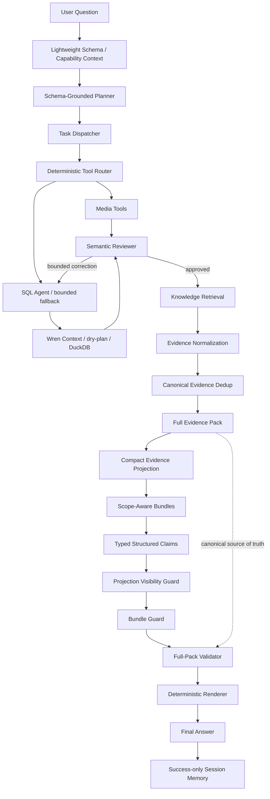

# DataPilot-Media Final Project Report

## 1. Project overview

DataPilot-Media is an experimental domain-agent prototype for audio/video
quality analysis and incident troubleshooting. It extends the DataPilot Agent
runtime with a synthetic Media Wren project, read-only domain tools, Knowledge
RAG, structured evidence contracts, and a deterministic final-answer boundary.

The implementation preserves the original DataPilot workflow ownership:

- Planner: intent, decomposition, dependencies, and task descriptions;
- Tool Router and SQL Agent: read-only data access and bounded correction;
- Reviewer: semantic approval gate;
- Analyst: deterministic normalization and evidence preparation;
- Final Claims: typed selection of already available evidence;
- Validator and Renderer: reject unsupported claims and render the answer;
- Session Memory: commit only after complete success.

WrenAI remains the semantic engine and connector layer. DataPilot-Media does not
reimplement or claim ownership of Wren's MDL, planning engine, or connectors.

## 2. Problem definition

Media incident questions combine several failure-prone operations:

1. identify the correct QoE metric and aggregation;
2. compare compatible baseline/current windows;
3. locate the affected region or CDN;
4. query alarms and logs with compatible scope;
5. retrieve error-code meaning and troubleshooting SOPs;
6. distinguish database facts, domain knowledge, hypotheses, and limitations;
7. avoid turning temporal correlation into causation.

An executable query does not prove that these contracts are correct. The
project therefore treats semantic review, evidence scope, provenance, and claim
validation as first-class workflow stages.

## 3. Architecture

The Full Evidence Pack is the local canonical source of truth. The Final Claims
LLM sees only the deterministic Compact Projection and scope-aware bundle
metadata. The Full-Pack Validator checks the returned claims against the local
pack before the deterministic renderer produces user-facing text.

## 4. Agent workflow

The end-to-end lifecycle is:

1. fetch lightweight Wren planning context;
2. generate the existing query/analysis/response task contract;
3. route query tasks to a strict Media tool or SQL path;
4. dry-plan and execute against Wren/DuckDB;
5. review metric, filters, dimensions, windows, aggregation, and result shape;
6. perform at most one semantic correction per query task;
7. retrieve at most five relevant Media knowledge chunks;
8. normalize paired comparisons across supported Planner shapes;
9. deduplicate equivalent comparison facts and retain provenance;
10. build the Full Evidence Pack and bounded Compact Projection;
11. generate typed claims constrained by deterministic bundles;
12. run projection, bundle, numeric, causal, and evidence guards;
13. deterministically render evidence sections;
14. commit Session Memory only after complete success.

Technical retries, structured-output retries, and semantic corrections have
separate fixed limits. There is no unbounded agent loop and no LangGraph
dependency.

## 5. Implementation phases

### Phase 1 — Media data foundation

- Added the isolated `domains/media/` Wren project.
- Added deterministic playback-session data across four comparison windows.
- Added alarm correlation with a deliberate 华南 / CDN-B anomaly.
- Added schema-grounded planning so the Planner knows the available Media
  entities, metrics, dimensions, and tools.

### Phase 2 — Media Knowledge RAG

- Added QoE definitions, E302 meaning, codec knowledge, and troubleshooting SOPs.
- Added heading-aware chunking and structured chunk metadata.
- Added BM25, local semantic feature hashing, hybrid RRF, and deterministic
  reranking.
- Integrated retrieved knowledge without bypassing SQL, Reviewer, or Analyst.
- Added DATA / KNOWLEDGE / INFERENCE / LIMITATION evidence boundaries.

### Phase 3 — Tool, MCP, and evidence-grounded closure

- Added four strict read-only Media tools and deterministic routing.
- Exposed the same Tool contracts through a data-only stdio MCP server.
- Added metric/window binding and multi-shape comparison normalization.
- Preserved Tool and SQL-correction evidence additively.
- Added alarm distributions, bounded-sample semantics, scope guards, and
  canonical comparison deduplication.
- Added Compact Projection, deterministic bundles, typed claims, validators,
  deterministic rendering, and success-only memory commit.

## 6. Media domain

The deterministic fixture contains:

| Model | Description |
|---|---|
| `stream_sessions` | session-grain playback attempts and QoE fields |
| `alarm_events` | alarm code, severity, lifecycle state, CDN, region, message |
| `log_events` | structured service, level, trace, error-code, and message data |
| `transcode_jobs` | synthetic codec/job status and GPU-pool data |

The Wren layer also contains two aggregate views and a QoE cube. Sessions and
alarms are not directly joined at row grain because that would multiply session
records. Correlation is performed after aggregation by time window, region, and
CDN.

The primary fixture incident is:

| Scope | Previous window | Current window | Delta |
|---|---:|---:|---:|
| 华南 overall | 93.33% | 71.67% | -21.67 pp |
| CDN-A | 95% | 85% | -10 pp |
| CDN-B | 95% | 50% | -45 pp |
| CDN-C | 90% | 80% | -10 pp |

CDN-B also has three current-window high-severity E302 alarms with mixed states:
`open=1`, `investigating=1`, and `resolved=1`.

## 7. Tool Calling

| Tool | Purpose |
|---|---|
| `query_qoe_metrics` | aggregate playback success, startup, buffering, and session counts |
| `get_alarm_events` | return scoped alarm rows and deterministic distributions |
| `query_logs` | return bounded structured CDN/origin logs |
| `get_transcode_status` | return synthetic transcode-job status |

Each tool has a strict input schema, rejects unknown fields, accepts only
bounded read-only operations, and returns structured evidence metadata. The
Router first uses deterministic capability matching. SQL remains a bounded
fallback/correction path rather than being replaced by tools.

## 8. MCP

`domains.media.runtime.mcp_server` exposes the same four registry contracts over
stdio. The server:

- accepts only structured Tool parameters;
- marks the tools read-only;
- rejects additional properties;
- initializes Wren from the selected Media project/profile;
- does not require or forward LLM credentials;
- leaves SQL safety, Wren planning, and Tool validation intact.

The final smoke evaluation established a real stdio client/server session and
passed all seven catalog, execution, invalid-input, unknown-tool, and empty-call
checks.

## 9. Knowledge RAG

The Media corpus has 16 heading-aware chunks from QoE, error-code, codec, and SOP
documents. Retrieval supports:

- BM25 lexical ranking with configured aliases;
- deterministic local TF-IDF feature-hash vectors with domain concepts;
- reciprocal-rank fusion;
- deterministic domain-aware reranking.

The semantic path does not use a pretrained sentence embedding. Retrieval is
local and deterministic, and the Agent sends at most five matched synthetic
chunks to an authorized external model call.

## 10. Reviewer and SQL correction

The Reviewer treats successful execution and semantic correctness as different
conditions. It checks the current Planner task's metric, unit, aggregation,
dimensions, filters, windows, and result shape. A correction cannot expand the
task contract or overwrite already valid Tool evidence.

The final Real E2E used three bounded semantic corrections:

- overall QoE: add the missing baseline windows;
- alarms: add broader scoped distributions while retaining the E302 subset;
- logs: add window/level/service/error-code distributions and bounded samples.

All corrected tasks were approved. Technical retry remained zero.

## 11. Evidence Pack

The Full Evidence Pack separates:

- **DATA EVIDENCE** — approved Tool/SQL facts and comparisons;
- **KNOWLEDGE EVIDENCE** — retrieved definitions and SOP statements;
- **INFERENCE** — typed correlation, hypothesis, and recommendation claims;
- **LIMITATION** — causal and evidence gaps.

Raw result evidence, deterministic summaries, correction evidence, comparison
facts, knowledge chunks, and limitations keep source IDs. The pack remains
local and is used as the final Validator's canonical source of truth.

## 12. Scope and provenance

Evidence carries region, CDN, error code, severity/level, group dimensions,
window roles, metric, unit, and aggregation semantics where applicable. Scope
guards reject incompatible joins such as mixing an ALL-alarm distribution with
an E302-only fact.

Canonical comparison identity includes the evidence type, metric, unit,
aggregation, business filters, group dimension/value, and baseline/current
windows. Equal facts merge into one model-visible item while retaining all
source tasks, source evidence IDs, baseline/current source IDs, derivation
types, and Tool/SQL lineage. Conflicting values for the same identity fail
closed; they are never averaged, overwritten, or silently ignored.

## 13. Context budget

The projection applies deterministic priority:

- P0: required comparisons, alarm/log distributions, scope, required knowledge,
  and limitations;
- P1: bounded samples and secondary knowledge;
- P2: lineage/debug/redundant metadata, retained locally but omitted from the
  model projection.

Final Real E2E sizes:

| Metric | Characters |
|---|---:|
| Full Evidence Pack | 32,710 |
| Compact Projection | 13,282 |
| Bundle metadata | 4,511 |
| Fixed prompt | 5,500 |
| Analyst context | 194 |
| Final prompt | 18,782 |
| Hard limit | 20,000 |
| Remaining | 1,218 |

The resulting projection/full-pack ratio was approximately 0.4061. If all P0
evidence cannot fit, projection fails closed rather than silently removing it.

## 14. Structured claims

Supported claim types are:

| Type | Minimum support |
|---|---|
| observation | Data Evidence |
| knowledge | Knowledge Evidence |
| correlation | compatible Data + Data; Knowledge is optional |
| hypothesis | Data plus Knowledge or an explicit Limitation |
| recommendation | Knowledge plus event Data or Limitation |
| causal claim | explicit causal evidence; otherwise rejected |

Claims also include a bundle ID, predicate, polarity, supporting evidence IDs,
and—when needed—subject evidence IDs. `stable_control` uses structured predicate
and polarity rather than keyword matching. In the final case, the negative
stable-control claim correctly stated that CDN-A and CDN-C also declined.

## 15. Validator and renderer

The final boundary is:

1. Projection Visibility Guard rejects evidence IDs the model could not see.
2. Bundle Guard rejects cross-scope evidence combinations.
3. Full-Pack Validator checks the typed claim against canonical local evidence.
4. Numeric, causal, mixed-status, bounded-sample, stable-control, and source-ID
   rules run before rendering.
5. The deterministic renderer creates the four evidence sections from validated
   facts and claim types, not from free-form model prose.

The final Real E2E returned `valid=true`, `violations=[]`,
`projection_guard_valid=true`, and `bundle_guard_valid=true`.

## 16. Session Memory

Session Memory stores compact business context for follow-up resolution. It is
separate from Wren SQL Memory. The workflow commits it only after all tasks,
claims, guards, validation, and rendering succeed. A failed turn cannot poison
the last verified session state.

## 17. Final evaluation

All numbers below are labeled by evaluation scope.

### Agent workflow

| Evaluation | Result |
|---|---|
| Offline deterministic direct tools | 4/4 completed |
| Offline deterministic Planner shapes | 6/6 completed |
| Overlapping canonical fixture | 24 derived facts → 8 canonical facts; 24 provenance sources retained |
| Single authorized Real DeepSeek E2E | PASS; 7/7 tasks completed |
| Real E2E LLM calls | 14 |
| Real E2E wall latency | approximately 126.76 s |
| Real E2E retries | technical 0 / semantic 3 / structured 0 |

Offline completion measures deterministic contracts and fixtures. It is not
live-model accuracy.

### Tool evaluation

| Metric | 18-case synthetic Tool Golden Set |
|---|---:|
| Selection accuracy | 1.0 |
| Argument accuracy | 1.0 |
| Execution success | 1.0 |
| Expected SQL fallback | 3/18 cases (rate 1/6) |
| Invalid selection | 0 |
| Router model calls | 0 |

### Retrieval evaluation

| 15-case synthetic mode | Recall@1 | Recall@3 | MRR@3 | Unrelated no-result |
|---|---:|---:|---:|---:|
| Lexical / BM25 | 0.785714 | 1.000000 | 0.928571 | 1.000000 |
| Semantic | 0.571429 | 0.928571 | 0.773810 | 1.000000 |
| Hybrid RRF | 0.785714 | 1.000000 | 0.916667 | 1.000000 |
| Hybrid + Rerank | 0.928571 | 1.000000 | 1.000000 | 1.000000 |

On this small synthetic set, Hybrid + Rerank has the strongest metrics. Plain
Hybrid does not uniformly outperform BM25.

## 18. Real E2E

Question:

> 华南播放成功率下降并出现 E302，结合告警、日志和知识库分析原因，并给出排查建议。

The single authorized Phase 3.11 run completed:

`Planner → Tool Router → Tool/SQL → Reviewer → Retrieval → Evidence
Normalization → Canonical Dedup → Full Pack → Projection → Bundles → Structured
Claims → Guards → Full-Pack Validator → Renderer → Session Memory`.

It correctly reported the overall and per-CDN paired comparison, retained the
mixed E302 status distribution, used structured log evidence, described E302 as
an upstream-timeout symptom, and identified it as a leading candidate factor
without claiming proven causation. The bounded summary is retained at
`evals/media/phase3_real_e2e_result.json`.

## 19. Reliability

Latest completed checks before project closure:

| Check | Result |
|---|---:|
| `tests/media` | 219 passed |
| `tests/datapilot` | 190 passed |
| Phase 3.11 directed tests | 11 passed |
| MCP smoke | 7/7 passed |
| Tool Golden Set | 18 cases completed |
| Retrieval unrelated no-result | 1.0 in all four modes |
| Wren build | 4 models, 2 views |
| Wren validate | 4 models, 2 views, 0 relationships |
| Strict UTF-8 MDL read | passed, no BOM |
| `git diff --check` | passed |

The final closure run repeats the two test suites, MCP smoke, Tool Golden Set,
Retrieval Eval, Wren UTF-8 build/validate, and `git diff --check` once after the
documentation is complete.

## 20. Known limitations

- All Media data, alarms, logs, transcode jobs, and knowledge examples are
  synthetic.
- The 18-case Tool and 15-case Retrieval evaluations are small development
  sets, not held-out production benchmarks.
- Only a limited number of authorized Real DeepSeek runs were performed; the
  final reported result is one complete Phase 3.11 run.
- The semantic retrieval path is local deterministic TF-IDF feature hashing
  with aliases, not a pretrained embedding model.
- Real E2E latency is high. Semantic review and SQL correction increase LLM
  calls and latency.
- The evidence guards reduce specific unsupported-claim risks but do not imply
  zero hallucinations or universal correctness.
- The project is not a production monitoring, alerting, observability, or
  incident-management platform.
- It does not process media bytes, execute FFmpeg, or run real encoding and
  transcoding workloads.
- It has no frontend, production authentication/authorization, Redis, or
  distributed state backend.

## 21. Resume-ready metrics

These statements preserve their evaluation scope:

- 219 Media tests and 190 DataPilot regression tests passed in the final
  pre-closure baseline.
- On an 18-case synthetic Tool Golden Set, selection, argument validation, and
  execution each scored 1.0.
- On a 15-case synthetic Retrieval Eval, Hybrid + Rerank achieved Recall@1
  0.9286, Recall@3 1.0, and MRR@3 1.0.
- One authorized synthetic Real DeepSeek E2E completed the 7-task workflow with
  valid evidence claims, deterministic rendering, and success-only memory
  commit.
- Deterministic projection reduced a 32,710-character Full Evidence Pack to
  13,282 characters while keeping the final prompt at 18,782/20,000 characters.

## 22. Recommended resume bullets

- Extended a Wren-backed multi-step data Agent into an audio/video incident
  analysis prototype with schema-grounded planning, four typed read-only tools,
  Knowledge RAG, MCP, semantic review, and success-only session memory.
- Built an evidence-grounded answer pipeline using canonical comparison dedup,
  source provenance, scope-aware bundles, typed claims, full-pack validation,
  and deterministic rendering to prevent unsupported numeric and causal claims.
- Designed deterministic synthetic Media benchmarks: 18 Tool cases with 1.0
  selection/argument/execution results and 15 Retrieval cases where Hybrid +
  Rerank reached Recall@1 0.9286, Recall@3 1.0, and MRR@3 1.0.
- Bounded final-model context by projecting 32,710 characters of canonical
  evidence to 13,282 characters and completing a Real DeepSeek E2E within an
  18,782/20,000-character prompt budget.

## 23. Interview talking points

1. **Why schema-grounded planning?** The original Planner ran before Wren
   context and invented unavailable dimensions. A lightweight capability
   context fixed decomposition without moving SQL generation into the Planner.
2. **Why tools plus SQL?** Deterministic tools cover common Media operations,
   while SQL remains a reviewed bounded fallback for task-specific gaps.
3. **Why Full Pack and Projection?** The local pack preserves complete facts and
   provenance; the projection controls external context size without becoming a
   new source of truth.
4. **Why bundles?** Evidence IDs alone prove visibility, not compatibility.
   Bundles prevent regional, entity-only, and global knowledge evidence from
   being combined into unsupported claims.
5. **Why deterministic rendering?** The LLM selects typed claims; it does not get
   a final opportunity to introduce new numbers or convert correlation into
   causation.
6. **What remains?** Broader held-out evaluation, real telemetry/connectors,
   latency optimization, production security, and operational integration.

## Attribution

DataPilot-Media is secondary development on the WrenAI codebase. WrenAI
provides the MDL semantic engine, context and SQL-memory facilities, connectors,
CLI, MCP foundations, and SDKs. Existing repository licenses and path-specific
attribution are preserved.
