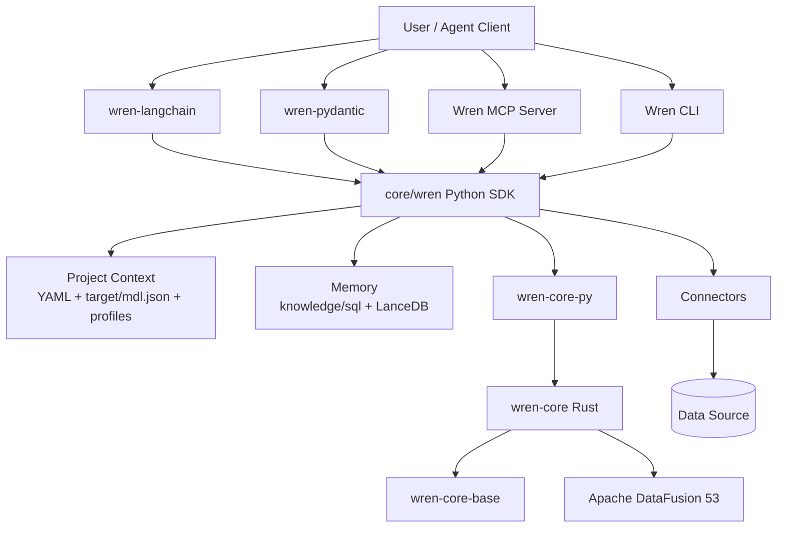
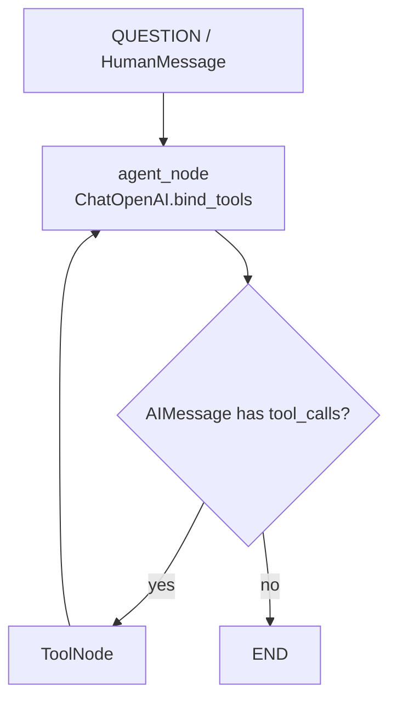
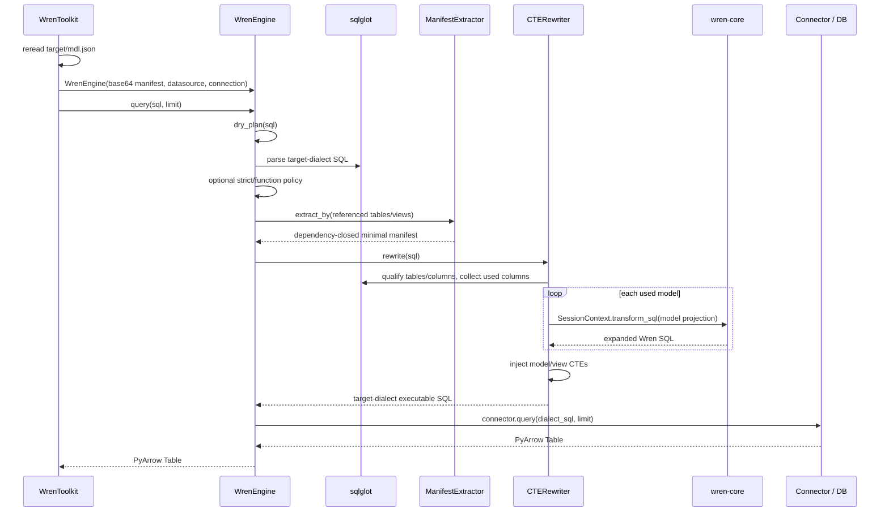

# WrenAI v0.13.3 原始代码分析（Phase 0）

> 分析日期：2026-08-30  
> 源码基线：`core/wren/pyproject.toml` 中的 `wrenai 0.13.3`  
> 阶段边界：本文件只记录原始仓库事实，不做 KEEP / REUSE / REFACTOR / REMOVE 决策，不修改核心实现，不执行裁剪。分类决策属于 Phase 1。

## 1. 结论摘要

当前仓库不是旧版“聊天 UI + AI Service + Docker 部署”的 WrenAI。根目录 README 和仓库结构都表明：旧应用已迁移到 `legacy/v1`，当前主线是 **Open Context Engine / GenBI Engine**。本地源码中不存在 `wren-ui/`、`wren-ai-service/`、`wren-launcher/`、`docker/` 或 `deployment/`。

这份 v0.13.3 源码已经提供了 DataPilot 可以复用的底层原语：

- Python `WrenEngine`，负责 MDL SQL 规划、方言转换、连接器执行与结构化错误。
- Rust `wren-core` 及 PyO3 绑定，负责 MDL 分析、逻辑计划、关系/计算字段展开和 SQL 反解析。
- YAML 项目上下文、编译后的 `target/mdl.json`、模型/关系/视图/Cube。
- Schema Context Retrieval、NL→SQL Query Memory、LanceDB 和本地 sentence-transformer embedding。
- LangChain/LangGraph 与 Pydantic AI 两套六工具适配器。
- 更完整的 MCP 工具、资源和工作流提示。

但是，原仓库**没有**实现需求中所说的 DataPilot Agent Application Layer：

- `langgraph_demo.py` 是只有 `messages` 状态的标准 ReAct 循环。
- 没有结构化 Planner、任务拆分、Reviewer、Analyst 或 Session Memory。
- 没有明确的多 SQL 任务调度；模型可以重复调用工具，但没有显式 task plan。
- LangChain 适配器没有确定性的 retry 上限；是否重试由 LLM 和外层 Agent 执行器决定。
- 没有 Reviewer 回退边或 Reviewer→SQL Agent 单次返工预算。
- 没有 DataPilot 所需的 trace schema、节点时延、token usage、任务级状态迁移。
- 现有 Eval 是外部 Agent 的人工评分 A/B 实验，不是可自动执行的 DataPilot workflow eval。

因此合理的二次开发边界是：**Wren 保持 Context / Semantic / Execution Engine，DataPilot 新增一个小型、显式状态、可测试的 Python Agent Application Layer。**

## 2. 分析方法、证据和环境限制

本阶段完成了两层扫描：

1. 仓库级静态盘点：顶层目录、包清单、构建清单、CI、测试目录、examples、evals、skills 和跨模块引用。
2. 调用链级逐文件阅读：用户指定的 LangGraph、Toolkit、Tools、Memory、Prompt、Engine、MCP 文件，以及它们直接调用的 provider、formatter、context、connector、PyO3 和 Rust planning 代码。

主要深读入口：

- `sdk/wren-langchain/examples/langgraph_demo.py`
- `sdk/wren-langchain/src/wren_langchain/_toolkit.py`
- `sdk/wren-langchain/src/wren_langchain/_tools.py`
- `sdk/wren-langchain/src/wren_langchain/_tools_memory.py`
- `sdk/wren-langchain/src/wren_langchain/_prompt.py`
- `core/wren/src/wren/engine.py`
- `core/wren/src/wren/mdl/cte_rewriter.py`
- `core/wren/src/wren/context.py`
- `core/wren/src/wren/memory/`
- `core/wren/src/wren/mcp_server.py`
- `core/wren-core-py/src/context.rs`
- `core/wren-core-py/src/extractor.rs`
- `core/wren-core/core/src/mdl/mod.rs`
- `evals/spodbtify_ab/`

当前工作目录有两个必须如实记录的限制：

- 它不是 Git 工作树：`git status` 返回 `fatal: not a git repository`，目录中没有可用的 `.git` 元数据。因此本阶段无法读取 commit 基线、生成 `git diff` 或创建 commit。
- 当前终端没有 `python`、`uv`、`pytest`、`cargo` 或仓库本地虚拟环境。因此本阶段不能运行 Python/Rust 测试，也不能运行 eval validator；下文的“测试现状”来自测试源码与 CI 配置的静态审计，不冒充本地测试结果。

## 3. 仓库真实结构与版本

| 路径 | 实际职责 | 版本/规模事实 | 直接依赖关系 |
|---|---|---|---|
| `core/wren/` | Python SDK、CLI、项目上下文、连接器、Memory、MCP、GenBI helpers | `wrenai 0.13.3`；约 161 个 Python 文件 | 依赖 `wren-core-py>=0.7.5`、sqlglot、PyArrow、DuckDB、Typer、Pydantic；memory/mcp/各数据库驱动是 extras |
| `core/wren-core/` | Rust 语义引擎与 DataFusion 规划 | Cargo workspace `0.3.1`；约 68 个 Rust 文件 | 依赖 DataFusion 53 和 `wren-core-base` |
| `core/wren-core-base/` | Manifest/MDL 基础类型和 builder/macro | Cargo workspace `0.3.1` | 被 Rust core 和 PyO3 binding 使用 |
| `core/wren-core-py/` | PyO3 绑定模块 `wren_core` | Python 包 `0.7.5`，Cargo crate metadata `0.1.0` | 绑定 `wren-semantic-core` 和 `wren-core-base` |
| `core/wren-core-wasm/` | 浏览器端 WASM 语义 SQL 能力 | 独立 npm/WASM 产物 | 不在 Python DataPilot CLI 的必经运行链上 |
| `core/wren-mdl/` | MDL JSON Schema | 单一 schema artifact | 项目/文档/验证契约 |
| `sdk/wren-langchain/` | LangChain/LangGraph 适配层 | `wren-langchain 0.2.1`；98 个静态检出的 Python test 函数 | 依赖 `wrenai>=0.13.1`、LangChain、LangGraph |
| `sdk/wren-pydantic/` | Pydantic AI 适配层 | `wren-pydantic 0.2.1`；104 个静态检出的 Python test 函数 | 依赖 `wrenai>=0.13.1`、`pydantic-ai>=1,<2` |
| `evals/spodbtify_ab/` | Schema-only vs dbt-integrated 外部 Agent A/B eval | 20 问、人工/外部 grader 三维评分 | 依赖仓库外 DuckDB 与 dbt artifacts，以及任意外部 agent command |
| `examples/v5-jaffle/` | schema v5 项目布局示例 | 2 models、1 relationship、1 view、1 cube、1 query-memory markdown、1 GenBI HTML | 没有随仓库提供可直接查询的数据库 |
| `skills/` | AI client 安装用 discovery stub | 实际工作流内容不在这里 | stub 引导调用 `wren skills get ...` |
| `core/wren/src/wren/skills_content/` | 随 `wrenai` wheel 分发的真实 skill 内容 | onboarding、usage、generate-mdl、dlt-connector、enrich-context、genbi 共 6 个目录 | `skills_delivery.py` 通过 package resources 读取 |

### 3.1 模块依赖总图



需要注意：两个 Agent SDK 的 `pyproject.toml` 都声明 PyPI 依赖 `wrenai>=0.13.1`，根目录没有把它们组织成一个 Python workspace。后续若同时修改 `core/wren` 与 Agent 层，开发环境必须显式使用本地 editable/install overlay，否则 SDK 可能解析到已发布的 `wrenai`，而不是当前源码。

## 4. 用户请求如何进入 LangGraph Agent

入口在 `sdk/wren-langchain/examples/langgraph_demo.py:127-174`。

真实流程如下：

1. `main()` 从 `PROJECT_PATH` 读取 Wren 项目路径，从 `QUESTION` 读取问题；缺省问题是列出模型并总结。
2. 示例只检查 `OPENAI_API_KEY`，模型在 `build_app()` 中默认硬编码为 `gpt-4o`；当前没有独立 LLM client 或 `LLM_BASE_URL` / `LLM_MODEL` 配置层。
3. `WrenToolkit.from_project(project_path)` 绑定一个已由 CLI 准备好的项目。
4. `build_app()` 获取 `toolkit.get_tools()` 和 `toolkit.system_prompt()`，并执行 `ChatOpenAI(...).bind_tools(tools)`。
5. 用户问题被包装成 `HumanMessage`，初始 state 只有 `{"messages": [...]}`。
6. `agent_node` 首轮在消息前临时插入 Wren system prompt，然后调用模型。
7. 如果最后一个 `AIMessage` 有 `tool_calls`，路由到 LangGraph `ToolNode`；否则结束。
8. `ToolNode` 执行工具并追加 `ToolMessage`，然后无条件回到 `agent_node`。



`AgentState` 的唯一字段是：

```python
messages: Annotated[list[BaseMessage], add_messages]
```

因此原始 LangGraph 示例的事实边界是：

- `add_messages` 让完整消息序列持续增长。
- 注释建议用户自行增加 `user_id`、`session_meta`、`trace`，但这些字段并未实现。
- 没有 `original_query`、`task_plan`、`pending_tasks`、`sql_results`、`review_result` 等显式任务状态。
- 没有 checkpoint/session store。
- 循环停止条件仅是“模型不再请求工具”；源码没有最大图步数、SQL retry=2 或 Reviewer retry=1。
- 多次 SQL 在技术上可以由 LLM 多次发起 `wren_query`，但没有显式任务拆解、完成标记或跨 SQL 一致性检查。

这说明它是可扩展示例，不是完整 Data Agent orchestration。

## 5. WrenToolkit 如何向 Agent 提供 Tools

### 5.1 初始化

`WrenToolkit.from_project()` 位于 `_toolkit.py:156-229`，执行以下校验和绑定：

1. 将路径 `expanduser().resolve()`。
2. 要求 `<project>/wren_project.yml` 存在。
3. 要求 `<project>/target/mdl.json` 存在。
4. 加载 `<project>/.env`，并使用 `override=False` 保留进程中已有环境变量。
5. `ProjectMDLSource` 每次调用都重新读取 `target/mdl.json`，因此 context build 的变更可在下一次 tool call 生效。
6. `ProfileConnectionProvider` 按以下优先级解析 profile：显式 `profile=` → `wren_project.yml` 的 `profile` → 全局 active profile。
7. 仅根据 `<project>/.wren/memory/` 是否是目录来启用或禁用 memory tools。

Toolkit 保存两个生命周期缓存：

- Connector cache：每个 toolkit 首次 query/dry_run 后复用数据库连接；每次 tool call 仍重建 `WrenEngine`，以读取最新 manifest。
- MemoryStore cache：避免重复加载 sentence-transformer 与重复打开 LanceDB。

### 5.2 Tool 组装

`get_tools()` 先构建 3 个 runtime tools；memory directory 存在时，再增加 2 个只读 memory tools，并按 `include_memory_write` 决定是否增加写工具。

| Memory 状态 | `include_memory_write` | 工具数量 | 工具 |
|---|---:|---:|---|
| disabled | 任意 | 3 | query、dry_plan、list_models |
| enabled | `False` | 5 | 3 runtime + fetch_context + recall_queries |
| enabled | `True` | 6 | 上述 5 个 + store_query |

`raise_on_error=False` 时，LangChain Tool 捕获异常并返回 envelope；`True` 时重新抛出给外层框架。成功/错误协议分别是：

```text
success = {ok, content, data, warnings}
error   = {ok=false, content, error={code, phase, message, metadata}}
```

WrenError metadata 会递归脱敏 password/secret/token/credential，并限制到 4 KiB；query 的 LLM-facing 文本限制 16 KiB，tool 的 row limit 限制 1..1000。

### 5.3 System prompt

`_prompt.py` 从实际工具名动态生成工作流：

```text
recall（若存在）
→ fetch context（若存在；否则必要时 list models）
→ compose Wren-model SQL
→ complex query 才 dry_plan
→ query
→ store（若存在）
```

它还提供 phase-aware 的错误恢复提示，并要求不要直接查询物理表。

源码中存在一个与 schema v5 项目布局相关的真实断点：`_build_instructions_section()` 只读取 `<project>/instructions.md`，而 `core/wren/context.py` 已将该文件标为 legacy，当前业务规则位于 `knowledge/rules/*.md`。因此 `examples/v5-jaffle/knowledge/rules/business-rules.md` 不会自动进入 LangChain system prompt。MCP 的 `get_instructions` 使用 `load_rules()`，没有这个断点。

## 6. 六个现有 Tool 的真实实现

### 6.1 `wren_list_models`

实现：`sdk/wren-langchain/src/wren_langchain/_tools.py:104-120`。

- 不访问数据库。
- 重新读取 `target/mdl.json`。
- `content` 是包含 model、列数和 description 的 Markdown 表格。
- `data.models` 返回 manifest 中的原始 models 列表。
- 它不是 schema embedding retrieval；它只是完整模型目录的轻量枚举。

### 6.2 `wren_fetch_context`

实现路径：

```text
wren_fetch_context
→ toolkit.memory.fetch
→ load current target/mdl.json
→ MemoryStore.get_context(manifest, question, filters...)
```

参数：`question`、`limit=5`、可选 `item_type`、可选 `model`。

关键行为：

- 小 schema 的 plain-text 描述长度 `<= 30_000` 字符时，直接返回完整 schema，`strategy="full"`；此路径不使用 embedding，`limit/item_type/model` 过滤器也不会缩小结果。
- 大 schema 才查询 LanceDB `schema_items`，`strategy="search"`。
- Search 会用当前 manifest hash 过滤旧索引，并可按 item type/model 过滤。
- 如果 memory directory 存在但大 schema 尚未建立 `schema_items` 表，search 返回空列表，不会自动重建索引。
- LangChain Tool 的 `item_type` 类型限制为 model/column/relationship/view；底层 index 还可存 cube、measure、cube_dimension、time_dimension，但此 Tool 的 Literal 没有暴露这些值。

“business context”在这条路径中具体指 MDL 内已有的 description、accepted values、data scope、关系、计算表达式、Cube 定义等。`knowledge/rules/*.md` 不是 `schema_indexer` 遍历的对象。虽然 `wren memory index` 会把规则放入临时 `_instructions` 字段，但 `describe_schema()` 和 `extract_schema_items()` 只遍历 models/relationships/views/cubes；本源码中没有看到 `_instructions` 被写入 `schema_items`。

### 6.3 `wren_recall_queries`

实现路径：

```text
wren_recall_queries
→ toolkit.memory.recall
→ MemoryStore.recall_queries
→ embed(question)
→ LanceDB query_history vector search
```

- 默认 top 3。
- LangChain SDK 没有传 datasource filter，所以同一 store 内不按 datasource 隔离。
- 返回记录包含 `nl_query`、`sql_query`、datasource、created_at、tags 等，去掉 vector。
- 没有内置“SQL 已执行成功”或“用户已确认正确”的校验；是否存入正确样例依赖调用者和 prompt 纪律。

### 6.4 `wren_dry_plan`

实现路径：

```text
wren_dry_plan
→ toolkit.dry_plan
→ new WrenEngine(current manifest)
→ WrenEngine.dry_plan
→ WrenEngine._plan
```

- 不建立数据库连接，不访问数据库。
- 返回已经过 MDL 展开和目标方言生成的 SQL。
- 能发现 SQL parsing、模型/列解析、MDL planning、policy 等规划阶段错误。
- 不能发现数据库权限、物理表缺失、驱动方言差异、运行时类型错误或超时等只有数据库能发现的问题。

### 6.5 `wren_query`

实现路径：

```text
wren_query
→ validate tool limit 1..1000
→ toolkit.query
→ WrenEngine.query
→ dry_plan
→ connector.query(dialect_sql, limit)
→ PyArrow Table
→ JSON-safe envelope
```

- 默认 100 行，LLM-facing hard cap 1000 行。
- `data.rows` 会完整 `to_pylist()`；仅 `content` 字符串有 16 KiB 截断提示。
- `WrenEngine.query()` 把非 WrenError 的 connector 异常包装成 `WrenError(SQL_EXECUTION)`，metadata 包含实际下发的 dialect SQL。
- 结果是事实数据，不包含自动分析、结论校验或 SQL 与原始问题的语义对齐判断。

### 6.6 `wren_store_query`

实现路径：

```text
wren_store_query
→ toolkit.memory.store
→ validate tags do not contain comma
→ MemoryStore.store_query
→ embed(nl)
→ append query_history
```

- 存储 NL、SQL、tags；tags 在 SDK 层被 join 为逗号分隔字符串。
- 没有执行 SQL、验证 SQL、去重或确认 answer correctness。
- 当前 LangChain SDK 直接写 LanceDB，不调用 `memory.markdown.write_query_markdown()`。

这里与 CLI/MCP 有明确语义差异：

- CLI `wren memory store`：总是写 `knowledge/sql/<slug>.md` 作为 source of truth，再 best-effort 写 LanceDB。
- MCP `store_query`：行为同 CLI，先写 Markdown，再 best-effort 写 LanceDB。
- LangChain/Pydantic SDK `wren_store_query`：只写 LanceDB，不写 Markdown source of truth。

因此“复用 SQL Memory”时不能把三条写路径视为完全等价。

## 7. Context Retrieval、Schema Retrieval 与项目上下文

仓库中“Context”至少有三层含义，必须区分。

### 7.1 项目上下文编译

`core/wren/src/wren/context.py` 读取：

- `wren_project.yml`
- `models/<name>/metadata.yml` 与可选 `ref_sql.sql`
- `views/<name>/metadata.yml` 与可选 `sql.yml`
- `relationships.yml`
- `cubes/<name>/metadata.yml`

`build_manifest()` 产生 snake_case manifest，`build_json()` 转 camelCase 并写入与 schema version 对应的 `layoutVersion`，`save_target()` 输出 `target/mdl.json`。

业务规则是独立知识轴：`load_rules()` 合并 `knowledge/rules/*.md` 与 legacy `instructions.md`。规则不会进入正常的 engine-facing `build_manifest()`。

### 7.2 Agent Schema Retrieval

有两个互补入口：

- `wren_list_models`：快速查看所有模型，不依赖 memory extra。
- `wren_fetch_context` / MCP `get_context`：小 schema 返回完整描述，大 schema 使用 embedding top-k。

Schema index 的记录粒度是：

- model
- column
- relationship
- view
- cube
- measure
- cube dimension
- time dimension

每条记录同时保存 embedding 文本与 `item_type`、`model_name`、`item_name`、data type、expression、calculated flag、manifest hash、indexed timestamp。

### 7.3 Engine 查询时的最小 Manifest Extraction

这不是 embedding retrieval，而是 SQL 已生成后的确定性依赖裁剪。

`WrenEngine._plan()` 先用 sqlglot 找出 SQL 引用的表/视图，再调用 Rust binding `ManifestExtractor.extract_by(tables)`。Extractor 会保留：

- 直接引用的 models。
- 通过 relationship column 依赖的相关 models。
- RLAC 子查询中引用的 models。
- 被引用 view 及 view SQL 所需 models。
- 与保留 models 有关的 relationships。
- base object 仍被保留的 cubes。

这个最小 manifest 只为降低单次 planning 开销，不是 LLM schema linking，也不替代前置 Context Retrieval。

## 8. SQL Memory、Embedding 与 LanceDB

### 8.1 两个 Memory collection

`MemoryStore` 使用两个 LanceDB 表：

| 表 | 被 embedding 的文本 | 作用 |
|---|---|---|
| `schema_items` | 每个 MDL item 的合成描述 | 大 schema 下的上下文检索 |
| `query_history` | `nl_query` | 相似 NL→SQL few-shot recall |

### 8.2 Embedding 模型加载

`embeddings.py` 的默认配置：

- 环境变量：`WREN_EMBEDDING_MODEL`
- 默认模型：`paraphrase-multilingual-MiniLM-L12-v2`
- 默认维度常量：384
- 先尝试 Hugging Face local cache 的 `local_files_only=True`，失败后才允许在线加载。
- 同一进程对相同 `(model name, device, trust_remote_code)` 缓存模型。
- 实际维度通过现有 LanceDB table 或一次 probe 决定；切换到不同维度的模型而复用旧 store 会明确报错。

### 8.3 Schema Retrieval 算法

当前实现是“大小路由”，不是混合 reranker：

```text
describe_schema(manifest)
→ <= 30K chars: return full text
→ > 30K chars: vector search schema_items + optional metadata filters
```

LanceDB search 直接使用 query embedding 和 `.limit(k)`；源码中没有相似度阈值、BM25+vector 融合、cross-encoder rerank 或邻接关系扩展。

### 8.4 Query Memory 两种 backend

Core CLI/MCP 的 `index_backend.py` 还定义了：

- `GrepIndex`：没有 memory extra 时，对 `knowledge/sql/*.md` 做英文/数字 token overlap + NL substring 加权。
- `LanceDBIndex`：有 memory extra 时，用 `MemoryStore.recall_queries()` 做语义检索。

`WREN_MEMORY_BACKEND=grep|lancedb` 可强制选择；缺少 lancedb/sentence-transformers 时会降级为 grep。

但是 `wren-langchain` 不经过 `index_backend.get_index()`，而是直接依赖 `MemoryStore`。所以它没有 CLI/MCP 的 grep fallback，memory directory 不存在时直接隐藏三个 memory tools。

### 8.5 Seed Queries

`index_schema(seed_queries=True)` 会按 manifest 自动生成 seed NL→SQL：

- 每个非 raw-layer model 的基础 listing。
- 合理的 numeric column SUM。
- numeric by groupable non-numeric column。
- accepted values filter。
- relationship join 示例。

生成器会尽量排除 primary key、relationship key 和 `id`/`*_id` 这类不应求和的标识字段。Seed 被标记为 `source:seed`，re-index 时替换旧 seed，但保留用户记录。

## 9. `WrenEngine.query()` 的完整调用流程

入口：`core/wren/src/wren/engine.py:91-249`。



细节：

1. `WrenToolkit` 每次调用读取最新 manifest 并创建新 `WrenEngine`；如果已有 connector cache，则把旧 connector 注入新 engine。
2. `WrenEngine._plan()` 按 datasource 选择 sqlglot dialect，解析 SQL。
3. strict mode / denied functions 配置存在时先做 policy validation。
4. 提取最小 manifest；如果提取失败且未开启 policy 限制，回退到完整 manifest。
5. `get_session_context()` 使用最大 32 项的 LRU cache，key 包含 manifest、functions、properties、datasource。
6. `CTERewriter` 对 SQL 做 table/column qualification，确定每个 model 实际需要的列。
7. 对每个 model 构造 `SELECT <needed columns> FROM <model>`，交给 Rust `SessionContext.transform_sql()` 展开 tableReference/refSql、calculated columns、relationships 和访问控制。
8. Model expansion 以 CTE 注入原 SQL；MDL view 的 statement 被视为目标方言 native SQL，作为 view CTE 原样处理，并先注入其依赖 model CTE。
9. 生成目标数据库方言 SQL。
10. `query()` 懒加载 datasource connector 并执行，返回 `pyarrow.Table`。

### 9.1 Rust planning 内部边界

PyO3 `PySessionContext` 在构造时：

- base64 反序列化 Manifest。
- 根据 manifest 或参数选择 datasource functions。
- `AnalyzedWrenMDL::analyze(...)`。
- 构建 Unparse 与 LocalRuntime 两个应用了 Wren rules 的 DataFusion context。

`transform_sql_with_ctx()` 会：

1. 注册 remote functions。
2. 在隔离的 catalog snapshot 上应用 Wren analyzer/optimizer rules。
3. DataFusion `create_logical_plan(sql)`。
4. optimize logical plan。
5. 使用 WrenDialect unparser 重新生成 SQL。
6. 去除内部 MDL catalog/schema prefix 后返回。

这证明 Rust 层是确定性的语义规划引擎，不是 LLM Agent 或自然语言 Planner。

## 10. `dry_plan`、`dry_run` 与 `query` 的区别

| API | MDL planning | 数据库 round-trip | 返回 | 能发现的问题 |
|---|---:|---:|---|---|
| `dry_plan(sql)` | 是 | 否 | 目标方言 SQL string | SQL/MDL/policy/语义规划问题 |
| `dry_run(sql)` | 是 | 是 | `None`（成功） | 上述问题 + 数据库 planner/权限/物理对象/部分方言与类型问题 |
| `query(sql, limit)` | 是 | 是并执行 | PyArrow Table | 上述问题 + 实际执行错误/超时，并得到数据 |

特别重要：需求中的“SQL 合法后执行”如果只调用现有 `wren_dry_plan`，只能证明 Wren planning 成功，不能证明数据库会接受 SQL。原 `WrenToolkit` 有直接 `dry_run()` API，但 `wren-langchain` 当前没有把它注册为第七个 LLM tool。DataPilot 后续必须明确选择：复用 direct `toolkit.dry_run()`，还是把 `dry_plan` 仅作为便宜的第一层校验。

## 11. MCP Server 已提供的能力

入口：`core/wren/src/wren/mcp_server.py`，基于 FastMCP。

### 11.1 Query tools

有数据库连接时：

- `run_sql`：执行 Wren SQL；默认 1000、硬上限 10000，并用 N+1 判断 truncation。
- `dry_run`：规划后请求数据库校验，不返回行。
- `query_cube`：结构化 cube/metric query，可只生成 SQL。
- `dry_plan`：只做 MDL 展开，无 DB。

`no_connect=True` 时只保留 `dry_plan`。

### 11.2 Context tools

- `get_mdl`
- `list_models`
- `describe_model`
- `get_data_source`
- `list_cubes`
- `describe_cube`
- `list_functions`

### 11.3 Knowledge tools

- `get_instructions`
- `recall_queries`
- `get_context`
- `describe_schema`
- `list_stored_queries`
- `list_knowledge`

MCP `recall_queries` 经过 pluggable index backend，因此有 grep fallback；`get_context` 只有 memory extra 缺失时回退 full schema，已安装 memory 但索引/embedding 出错时会把真实错误向上抛出。

### 11.4 Write tool

仅 `allow_write=True` 时注册：

- `store_query`：先写 `knowledge/sql/*.md`，再 best-effort 写 LanceDB。

### 11.5 Resources 与 Prompt

Resources：

- `wren://mdl`
- `wren://instructions`
- `wren://project`
- `wren://agents`
- `wren://knowledge/{name}`
- `wren://knowledge/{subdir}/{name}`

Prompt：`wren_workflow(question)`，会根据 `no_connect` 和 `allow_write` 动态调整步骤。

MCP 已比 LangChain SDK 暴露更完整的 Wren 原语，但它仍是工具服务器，不包含 DataPilot Planner/Reviewer/Analyst graph。

## 12. 原有 Eval 做了什么

仓库只有 `evals/spodbtify_ab/` 一套独立 eval。

### 12.1 目标

对同一个 Spodbtify DuckDB 数据集比较两种上下文：

- `schema_only`：只允许物理 schema 与从 schema 生成的 Wren MDL。
- `dbt_integrated`：允许 dbt descriptions、refs/lineage、layer、tests、compiled SQL 和导入后的 Wren MDL。

### 12.2 数据和问题

- 数据集不在仓库内，通过 `SPODBTIFY_DUCKDB_PATH` 指向。
- dbt artifacts 不在仓库内，通过 `SPODBTIFY_DBT_PROJECT_DIR` 指向。
- spec 列出 19 张表及其声明行数。
- 固定 20 个复杂分析问题。

### 12.3 Runner 实际职责

`run_eval.py`：

- 验证 spec 的固定字段、问题 ID 1..20、两个 workflow、评分维度与 max total。
- 为单个问题渲染隔离 prompt。
- 生成所有 prompt files。
- 用字符串模板启动任意外部 agent shell command。
- 生成空 score template。
- 汇总已由人工或外部 grader 填写的分数。

它**不**执行 agent 返回的 SQL，不验证结果等价性，也不自动给分。

### 12.4 指标

每题三个 0/1/2 人工评分维度：

- `correct_table`
- `correct_sql`
- `correct_answer`

20 × 3 × 2 = 120 分。Runner 可计算 schema_only 与 dbt_integrated 的总分差，以及用户手工提供的多次 run mean。

### 12.5 与 DataPilot Eval 的差距

当前 Eval 没有：

- SQL Execution Success Rate 自动计算。
- 基于执行结果的语义等价判断。
- Task Success Rate。
- Reviewer Pass Rate / Retry Rate。
- Latency / Token Usage。
- Multi-step Task Success Rate。
- Memory Follow-up Accuracy。
- Planner/Reviewer/Session Memory ablation。

所以它可以作为“上下文质量 A/B 方法”的参考，但不能直接作为 DataPilot workflow eval 并声称为新增能力。

## 13. `sdk/` 中的另一个 Agent 适配器

`sdk/wren-pydantic/` 与 `wren-langchain` 共享同一底层：相同的 project/profile/memory provider、同样的 3 runtime + 3 memory tools 和同样的 read-through manifest/connector cache 设计。

区别在框架契约：

- 返回 Pydantic typed models，而不是 envelope dict。
- SQL/MDL 等可修复 WrenError 被转为 Pydantic AI `ModelRetry`。
- runtime/read-memory tools 注册 `retries=2`；`wren_store_query` 为 `retries=0`。
- connection/config/filesystem 等 infra errors 直接向外传播。

这是一套已有的有限 tool retry 实现，但它不是 DataPilot 的 graph-level Reflection：没有 Reviewer、没有 task state，也没有 SQL Agent 与 Reviewer 之间的单次返工预算。它仍值得在后续设计时参考其 error classification、secret redaction 和 retry message 做法。

## 14. Examples 与 Skills 的真实作用

### 14.1 `examples/v5-jaffle`

该示例展示当前 project schema v5：

- `customers` 通过 physical `table_reference` 映射。
- `orders` 通过 `ref_sql.sql` 映射。
- `orders_customer` relationship。
- `customer_orders` native SQL view。
- `order_metrics` cube，含 revenue 与 order count measures。
- `knowledge/rules/business-rules.md`。
- `knowledge/sql/total-revenue.md` confirmed NL→SQL pair。
- 一个静态 GenBI app HTML。

它适合验证项目布局、context build、关系和 memory source-of-truth，但仓库未提供它所需的 Postgres 数据库，因此不是开箱即用的 DataPilot demo database。

### 14.2 `skills/`

顶层 `skills/wren/SKILL.md` 只是 discovery stub，告诉外部 coding agent 调用：

```text
wren skills list
wren skills get <name>
wren docs connection-info <datasource>
wren ask <question> --guided|--direct
```

真实内容随 `wrenai` 包存放在 `core/wren/src/wren/skills_content/`，由 `skills_delivery.py` 使用 `importlib.resources` 读取。它们是让外部 Agent 操作 Wren CLI 的工作流文档，不是进程内 DataPilot Agent graph。

## 15. 现有测试与 CI 边界

### 15.1 `core/wren`

静态扫描到约 1317 个 `test_*` 函数/方法。CI 分开运行：

- 普通 unit tests。
- Postgres/MySQL connector tests。
- UI tests。
- memory extra tests。
- MCP extra tests。

CI 会先本地构建 `wren-core-py` wheel，再 overlay 到 `core/wren` 环境，因此核心 Python↔Rust 路径受到真实绑定测试。

### 15.2 `wren-langchain`

测试分为：

- unit：tool shape、envelope、prompt、provider、read-through manifest、connector cache、memory API。
- conformance：验证六工具都是 LangChain `BaseTool`，有 schema 且返回 JSON envelope。
- integration：真实 DuckDB query、真实 ToolNode 调用。
- slow integration：真实 LanceDB + sentence-transformer 的 fetch 与 store→recall round trip。

默认 pytest 配置排除 `slow`，SDK CI 注释也明确没有运行慢速 memory tests。

LangGraph integration test 手工构造 `AIMessage.tool_calls`，没有调用真实 LLM；它验证 ToolNode 接线，不验证自然语言→SQL 质量、循环停止、Planner 或 Reviewer。

### 15.3 `wren-pydantic`

覆盖相同 facade/provider/memory 契约，并额外验证 typed models、ModelRetry 映射与 Pydantic AI agent contract。

### 15.4 本阶段测试结果

```text
Attempted: python/uv/pytest discovery and eval spec validation
Result: NOT RUN
Reason: current shell has no python, uv, pytest, cargo or repo-local runtime
```

这不是测试失败，也不是测试通过；是运行环境缺失。恢复工具链后，至少应先运行：

```text
cd core/wren && just test
cd sdk/wren-langchain && pytest -v
cd sdk/wren-pydantic && pytest -v
python evals/spodbtify_ab/run_eval.py validate
```

Memory slow tests需显式包含 `slow` marker，并准备模型依赖。

## 16. 原始能力与 DataPilot 目标的边界

| 能力 | 原仓库事实 | DataPilot 后续需要新增的部分 |
|---|---|---|
| Semantic/Context Engine | 已有 MDL、关系、计算列、views、cubes、policy、规划 | 不重写 Rust engine；设计稳定适配边界 |
| Schema Retrieval | 已有 full-vs-vector retrieval | 组织为 SQL Agent 的确定性步骤，补齐规则上下文与 trace |
| SQL Memory | 已有 Markdown source、grep/LanceDB、seed、recall/store | 明确 SDK 写入一致性、成功后才存储的策略 |
| SQL planning/execution | 已有 dry_plan/dry_run/query | 编排校验顺序、错误分类与 retry budget |
| LangGraph | 只有 messages-only ReAct demo | 显式 AgentState、Planner/SQL Agent/Reviewer/Analyst nodes 与 router |
| Multi-step | LLM 可自由多次调 tool，但无任务模型 | 结构化 task plan、pending/completed、逐任务 SQL/results |
| Reflection | Pydantic tools 有 retries=2；LangChain靠模型自行修正 | graph-level、可观测、有界 SQL retry=2 / Reviewer return=1 |
| Session Memory | 不存在；消息不断累积 | 独立于 SQL Memory 的结构化 session context |
| Reviewer | 不存在 | 对问题覆盖、时间、聚合、维度、业务规则和结果证据做结构化审查 |
| Analyst | 不存在 | 只基于 SQL results 计算/总结，区分事实与分析 |
| Trace | 示例只打印消息和 tool counts | trace_id、state transition、tool args/result summary、SQL、latency、retry、tokens |
| Eval | 外部 Agent A/B + 人工评分 | DataPilot 自动 runner、结果语义比较、workflow/memory/multistep metrics |

## 17. 后续阶段必须保留的事实约束

这些不是 Phase 1 分类结论，而是由调用链推出的约束：

1. DataPilot 的 SQL execution adapter 最终依赖 `core/wren`、`wren-core-py`、`wren-core`、`wren-core-base` 和对应 connector；不能只保留 `sdk/wren-langchain`。
2. `target/mdl.json` 是 Agent SDK 的直接读取物，YAML project build/context 仍是它的上游依赖。
3. 若使用 `wren_fetch_context`/`wren_recall_queries`，必须保留 core memory、schema indexer、embedding 和 LanceDB extra；若希望无 extra fallback，则不能直接照搬现有 LangChain provider。
4. `dry_plan` 不能冒充数据库校验。实现 SQL Agent 时应明确使用 direct `dry_run` 或解释为何只做 planning validation。
5. v5 business rules 应从 `load_rules()`/`knowledge/rules` 进入 DataPilot context；不能只复用当前 `_prompt.py` 的 legacy `instructions.md` 读取。
6. SQL Memory 与 Session Memory 必须保持概念和存储边界分离。
7. Toolkit connector cache 不是线程安全/multi-tenant 连接池；当前 SDK 文档也明确 sync-only 和单 toolkit/agent 限制。
8. SDK 当前的 `wren_store_query` 与 CLI/MCP source-of-truth 语义不同，后续必须选定并测试一种一致策略。
9. DataPilot 不应把 MCP、Memory、Context Retrieval、WrenEngine 或 MDL 记作个人原创能力。
10. License 是路径分级的：`core/**`、`sdk/**`、`skills/**`、`examples/**` 为 Apache-2.0，`docs/**` 为 CC BY 4.0；根 LICENSE、版权和 trademark attribution 必须保留。

## 18. Phase 0 交付记录

### Changed Files

- 无核心代码变更。

### Added Files

- `docs/ORIGINAL_WRENAI_ANALYSIS.md`

### Deleted Files

- 无。

### Why

为 DataPilot 二次开发建立真实源码基线，避免把 Wren 原生 Engine、Context Retrieval、SQL Memory、MCP 或 Toolkit 误记为新增能力，并为 Phase 1 的依赖安全分类提供证据。

### Architecture Change

- 无。Phase 0 只分析，不改变运行架构。

### Tests

- 完成仓库结构、import/call-site、package manifest、CI、test source 的静态交叉检查。
- 尝试发现 Python/uv/pytest/cargo 和运行现有 eval validator。

### Test Result

- 静态检查：完成。
- 动态测试：未运行，原因是当前环境没有任何可用 Python/uv/pytest/cargo runtime。

### Remaining Risks

- 无 Git 元数据，无法核验源码是否与官方 tag commit byte-for-byte 一致，只能以包版本和当前文件内容确认 v0.13.3 基线。
- 未执行测试，运行时依赖兼容性仍需在 Phase 2 前建立开发环境后验证。
- 外部 Spodbtify 数据与 dbt artifacts 不在仓库中，原 eval 无法在当前环境完成端到端复现。
- Phase 1 必须对每个 REMOVE 候选做反向依赖搜索，不能从本分析中的“非 DataPilot 必经链”直接推导可删除。

### Suggested Commit

当前目录无法创建 Git commit。建议在恢复 `.git` 后提交：

```text
docs: analyze original WrenAI architecture for DataPilot
```

## 19. 关键源码索引

| 主题 | 主要证据文件 |
|---|---|
| LangGraph loop | `sdk/wren-langchain/examples/langgraph_demo.py:68-106,127-174` |
| Toolkit 初始化/缓存 | `sdk/wren-langchain/src/wren_langchain/_toolkit.py:28-229` |
| Runtime tools | `sdk/wren-langchain/src/wren_langchain/_tools.py:35-120` |
| Memory tools | `sdk/wren-langchain/src/wren_langchain/_tools_memory.py:26-123` |
| Prompt workflow | `sdk/wren-langchain/src/wren_langchain/_prompt.py:34-224` |
| Project context build | `core/wren/src/wren/context.py:529-846` |
| Engine flow | `core/wren/src/wren/engine.py:48-250` |
| CTE/model expansion | `core/wren/src/wren/mdl/cte_rewriter.py:236-320,844-911` |
| SessionContext cache | `core/wren/src/wren/mdl/__init__.py:1-39` |
| Schema retrieval | `core/wren/src/wren/memory/schema_indexer.py:60-365` |
| LanceDB store | `core/wren/src/wren/memory/store.py:74-407` |
| Embedding load | `core/wren/src/wren/memory/embeddings.py:1-119` |
| Query memory backends | `core/wren/src/wren/memory/index_backend.py:1-180` |
| Markdown source of truth | `core/wren/src/wren/memory/markdown.py:1-176` |
| Pydantic AI adapter | `sdk/wren-pydantic/src/wren_pydantic/_toolkit.py:30-235`, `_tools.py:35-140`, `_tools_memory.py:34-163`, `_errors.py:40-163` |
| PyO3 SessionContext | `core/wren-core-py/src/context.rs:76-276` |
| Minimal manifest extraction | `core/wren-core-py/src/extractor.rs:16-246` |
| Rust transform pipeline | `core/wren-core/core/src/mdl/mod.rs:424-563` |
| MCP surface | `core/wren/src/wren/mcp_server.py:115-707` |
| Existing eval | `evals/spodbtify_ab/run_eval.py`, `spodbtify_ab_eval.json` |
| CI test boundaries | `.github/workflows/wren-ci.yml`, `sdk-langchain-ci.yml`, `sdk-pydantic-ci.yml` |
