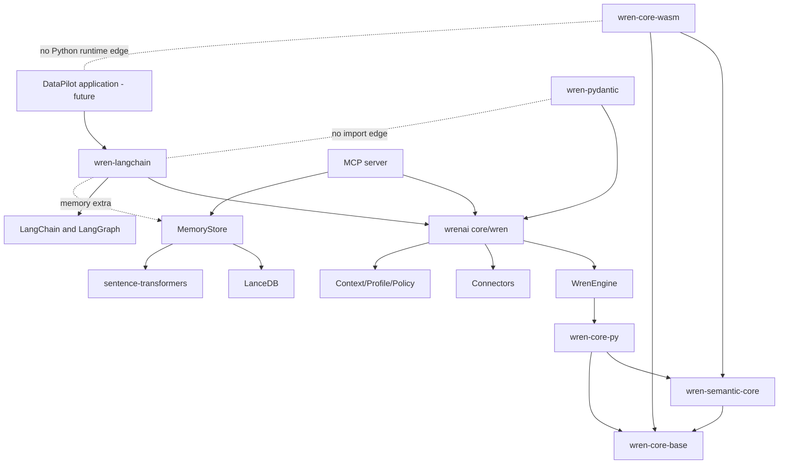

# DataPilot Repository Prune Plan（Phase 1）

> 分析日期：2026-08-30
> Git 基线：`datapilot-dev`，分析开始时 `HEAD=9da4edf`，working tree clean
> 源码基线：WrenAI `v0.13.3` 代码快照
> 阶段边界：本阶段只做依赖分类和删除计划，不删除、移动或重写任何仓库模块；Phase 2 未开始。

## 1. 决策摘要

DataPilot 不能被实现成一个只保留 LangGraph demo 的孤立 Python 项目。现有运行链是：

```text
DataPilot（未来）
  -> sdk/wren-langchain
  -> core/wren (wrenai)
       -> WrenEngine
       -> Context / Profile / Policy / Connector
       -> MemoryStore -> LanceDB + sentence-transformers
       -> MCP server
  -> core/wren-core-py
  -> core/wren-core + core/wren-core-base
```

因此，下列边界不可裁剪：

- `core/wren` 的 Engine、Context、Connector、Memory、MCP、Profile、Policy 和共享模型。
- `core/wren-core`、`core/wren-core-base`、`core/wren-core-py`、`core/wren-mdl`。
- `sdk/wren-langchain` 的 Toolkit、Tools、Providers、Memory adapter 和测试。
- 所有 LICENSE、NOTICE、版权、来源和商标归属文件。

明确可继续评估的裁剪面是与 Python DataPilot 主运行链单向隔离的分发面：WASM SDK、Pydantic AI SDK、外部 A/B eval、Rust 示例 crate、外部 Agent discovery stub、特定文档和专用 CI/发布工作流。

本计划共有 **62 个决策单元**：

| 分类 | 数量 | 含义 |
|---|---:|---|
| KEEP | 16 | 必须原样保留或默认保守保留；不是 DataPilot 改造点 |
| REUSE | 8 | DataPilot 将直接调用或包装其稳定能力 |
| REFACTOR | 15 | 路径保留，但内容需要适配 DataPilot 或同步裁剪后的仓库事实 |
| REMOVE | 14 | Phase 2 的条件性删除候选；本阶段未删除，必须通过各自门禁 |
| REVIEW | 9 | 产品边界或依赖意图仍未定；未决前按 KEEP 处理 |

分类计数按“可独立决策的路径单元”计算，不是逐文件计数。若一个宽路径和更具体路径重叠，以更具体路径的分类为准；未明确列出的任何路径一律默认 **KEEP**。

## 2. 分析方法与证据范围

本阶段以源码和仓库配置为证据，完成以下检查：

1. **Python import**：检查 `wren-langchain`、`wren-pydantic`、MCP、CLI、Memory、GenBI 和测试的 import/call sites。
2. **Package dependency**：检查三个 Python `pyproject.toml`、`uv.lock` 和 Hatch wheel package/artifact 配置。
3. **Runtime dependency**：追踪 `WrenToolkit -> WrenEngine -> Connector` 以及 `MemoryStore -> LanceDB/embedding`。
4. **SDK dependency**：确认 `wren-langchain` 与 `wren-pydantic` 都依赖 `wrenai`，但二者之间没有运行时 import。
5. **CI dependency**：检查 `.github/workflows/` 的 path filter、working directory、构建和测试命令。
6. **Build dependency**：检查 Cargo workspace member、PyO3 path dependency、WASM path dependency、Hatch build 和 release-please。
7. **Test dependency**：检查 core、connector、MCP、Memory、LangChain、Pydantic、WASM 和文档/skills guard tests。
8. **MCP dependency**：检查 `serve_cli.py -> mcp_server.py` 及其 Engine、Context、Knowledge、Memory 调用。
9. **Memory/LanceDB dependency**：确认 LangChain 直接 import `wren.memory.store.MemoryStore`，`wren-langchain[memory]` 透传到 `wrenai[memory]`。
10. **Wren Engine dependency**：检查 `wrenai -> wren-core-py -> wren-core -> wren-core-base` 和 Rust workspace。

当前环境没有 `python`、`python3`、`uv`、`pytest`、`cargo` 或 `rustc`，所以本阶段可以完成静态依赖验证和 Git 验证，但不能宣称运行测试通过。

## 3. 真实依赖拓扑



关键方向事实：

- `wren-langchain` 的 `pyproject.toml` 依赖 `wrenai>=0.13.1`、LangChain、LangGraph 和 Pydantic；memory extra 依赖 `wrenai[memory]`。
- `wren-langchain` 源码直接 import `wren.engine.WrenEngine`、`wren.context`、`wren.profile`、`wren.memory.store.MemoryStore` 和 Wren error model。
- `wrenai` 依赖发布的 `wren-core-py>=0.7.5`；本仓库的 CI/本地开发会构建 `core/wren-core-py` 并覆盖预编译 wheel。
- `wren-core-py` 的 Cargo manifest 以 path dependency 依赖 `../wren-core/core` 和 `../wren-core-base`。
- `wren-core-wasm` 也单向依赖 Rust core/base，但 Rust core、PyO3、`wrenai`、LangChain、MCP 和 Memory 不反向依赖 WASM 包。
- `wren-pydantic` 是与 LangChain 并列的独立 SDK。`core/wren` 和 `sdk/wren-langchain` 中没有 `wren_pydantic`/`pydantic_ai` import。
- MCP 模块由 `serve_cli.py` 延迟 import；删除 MCP 会破坏 `wren serve mcp`、MCP tests 和现有外部客户端，因此不在删除候选内。
- 顶层 `skills/` 不是 wheel package data；真实运行时 skill 内容位于 `core/wren/src/wren/skills_content/`，二者必须分开判断。

## 4. 构建、CI 和发布耦合矩阵

| 模块 | 构建/安装入口 | 上游依赖 | 下游/CI 依赖 | Phase 1 结论 |
|---|---|---|---|---|
| `core/wren-core-base` | Cargo crate + manifest macro | 无仓库内引擎上游 | Rust core、PyO3、WASM、release-please | KEEP |
| `core/wren-core/core` | `core/wren-core/Cargo.toml` workspace | core-base、DataFusion | PyO3、WASM、sqllogictest、benchmarks、example | KEEP |
| `core/wren-core-py` | Maturin + uv | Rust core/base | `wrenai` package、core CI、publish workflow | KEEP |
| `core/wren` | Hatch + uv | `wren-core-py`、connectors、optional extras | LangChain/Pydantic SDK、MCP clients、CLI users | KEEP/REUSE |
| `core/wren/memory` | `wrenai[memory]` | LanceDB、sentence-transformers | LangChain memory tools、MCP knowledge tools、CLI | REUSE |
| `sdk/wren-langchain` | Hatch | `wrenai`、LangChain/LangGraph | DataPilot future graph、dedicated CI/publish | REUSE/REFACTOR |
| `sdk/wren-pydantic` | Hatch | `wrenai`、pydantic-ai | 仅自己的 tests/docs/CI/release | REMOVE candidate |
| `core/wren-core-wasm` | Cargo + wasm-pack + npm | Rust core/base | GenBI browser distribution、WASM docs/CI/release | REMOVE candidate, HIGH gate |
| `core/wren-core/wren-example` | Rust workspace member | Rust core/DataFusion | 仅 workspace build | REMOVE candidate after workspace edit |
| `core/wren-core/sqllogictest` | Rust workspace member | Rust core | Engine SQL regression coverage | KEEP |
| `evals/spodbtify_ab` | standalone Python command | external DuckDB/dbt/agent command | 无 package/CI caller | REMOVE candidate after eval replacement decision |

## 5. KEEP（16）

| ID | 路径/单元 | 保留原因 |
|---|---|---|
| K01 | `LICENSE`, `LICENSE-AGPL-3.0`, `LICENSE-APACHE-2.0`, `LICENSE-CC-BY-4.0` | 根许可证和路径级许可映射；永久保留 |
| K02 | 所有嵌套 `LICENSE`/`NOTICE`/attribution 文件，包括 `core/wren-core-wasm/LICENSE`、`sdk/wren-pydantic/LICENSE` | 即使所属代码成为删除候选，许可文件也不进入 REMOVE 集合 |
| K03 | `CHANGELOG.md` 及保留模块的 changelog | 保留来源、历史和行为演进证据 |
| K04 | `AGENTS.md`, `.claude/**`, `core/*/AGENTS.md` | 工程规范、验证边界和构建约束 |
| K05 | `.editorconfig`, `.gitignore`, `CODE_OF_CONDUCT.md` | 基础工程和治理文件 |
| K06 | `core/wren-core-base/**` | Manifest 类型、builder、macro；Rust/PyO3 必需 |
| K07 | `core/wren-core/core/**` | DataPilot 保留的 Wren 语义规划核心 |
| K08 | `core/wren-core/sqllogictest/**` | Engine SQL 行为的主要端到端回归保障 |
| K09 | `core/wren-core-py/**` | Python 到 Rust Engine 的必经 PyO3 绑定 |
| K10 | `core/wren-mdl/**` | MDL JSON schema 契约和上下文校验基线 |
| K11 | `core/wren/{pyproject.toml,uv.lock,justfile}` | `wrenai` 安装、extras、锁文件和标准测试命令 |
| K12 | `core/wren/src/wren/{model/**,policy.py,sql_classify.py,type_mapping.py}` | Engine、Tools、Connector 共享类型、错误和安全策略 |
| K13 | `core/wren/tests/**`，但 F14 指定的两个 guard tests 除外 | Core/Connector/Memory/MCP 行为回归；不因商业化而删除测试 |
| K14 | `sdk/wren-langchain/{tests/**,LICENSE,CHANGELOG.md}` | 保护 Toolkit/Tools contract 和保留许可历史 |
| K15 | `docs/ORIGINAL_WRENAI_ANALYSIS.md` 与本计划 | 二次开发的事实基线和裁剪审计记录 |
| K16 | Wren core/LangChain CI 与发布工作流：`wren-ci.yml`, `core-py-ci.yml`, `rust.yml`, `sdk-langchain-ci.yml`, `publish-wren.yml`, `publish-wren-core-py.yml`, `publish-wren-crates.yml`, `publish-wren-langchain.yml`, `sync-wren-core-py-lock.yml` | 覆盖最终保留的 Engine、SDK 和 Python 适配层 |

## 6. REUSE（8）

| ID | 路径/单元 | DataPilot 复用方式 |
|---|---|---|
| U01 | `core/wren/src/wren/engine.py`, `mdl/**` | SQL plan、方言转换、manifest extraction、query/dry-run |
| U02 | `core/wren/src/wren/{context.py,dbt.py,osi.py,cube_cli.py}` | 项目上下文、MDL 编译、规则/Cube/外部语义元数据 |
| U03 | `core/wren/src/wren/connector/**` | 数据源连接、执行、limit 和 dry-run；保留全部现有 connector，避免预判客户数据源 |
| U04 | `core/wren/src/wren/memory/**` | Schema retrieval、SQL memory、LanceDB、embedding、seed queries、Markdown source of truth |
| U05 | `core/wren/src/wren/{config.py,profile.py,profile_cli.py}` | 连接 profile、strict mode、denied functions 和项目配置 |
| U06 | `core/wren/src/wren/{mcp_server.py,serve_cli.py}` | 保留现有 MCP 工具/资源面，DataPilot 可作为 MCP client 或并行服务 |
| U07 | `sdk/wren-langchain/src/wren_langchain/**`，但 F01 的 `_prompt.py` 除外 | 复用 Toolkit、六个 Tools、provider/cache、envelope、formatter 和 Memory API |
| U08 | `examples/v5-jaffle/**`，但 V04 的 `apps/sales-report/**` 除外 | schema v5、规则、关系、view、cube 和 SQL memory 的开发/验收 fixture |

## 7. REFACTOR（15）

| ID | 路径/单元 | 计划中的改造原因 |
|---|---|---|
| F01 | `sdk/wren-langchain/src/wren_langchain/_prompt.py` | 当前只读 legacy `instructions.md`；DataPilot 需对齐 `knowledge/rules/*.md` 和结构化工作流 |
| F02 | `sdk/wren-langchain/examples/langgraph_demo.py` | 从 messages-only ReAct demo 演进或被新的 DataPilot application graph 替代；不直接删除作为基线 |
| F03 | `sdk/wren-langchain/{pyproject.toml,README.md}` | 补充 DataPilot 支持边界、安装方式和必要依赖；仍保持 SDK 可独立安装 |
| F04 | `core/wren/src/wren/cli.py` | 后续挂载 DataPilot CLI；任何被裁剪命令的注册必须同步处理 |
| F05 | `core/wren/src/wren/context_cli.py` | 若删除顶层 skill installer，`context init` 的远程安装提示必须改写，不能留下 404 |
| F06 | `core/wren/README.md` | 删除候选完成后同步产品面、WASM/skills/GenBI 表述和安装矩阵 |
| F07 | `README.md` | 从通用 WrenAI 仓库首页调整为保留归属的 DataPilot 工程说明；不得抹去原项目 attribution |
| F08 | `CONTRIBUTING.md`, `SECURITY.md` | 若候选包未来获批删除，同步收敛其 build/security surface，同时保留贡献标准和支持政策 |
| F09 | `core/wren-core/Cargo.toml` | M04 删除前先从 workspace `members` 移除 `wren-example`；benchmarks/sqllogictest 不动 |
| F10 | `release-please-config.json`, `.release-please-manifest.json` | 删除 WASM/Pydantic package entry 和指向 WASM Cargo.lock 的 extra-files，保留 Rust linked versions |
| F11 | `.github/workflows/{release-please.yml,rc-release.yml}` | 删除被裁剪组件的 outputs、choice、publish jobs 和 aggregate `needs`，避免 dangling reusable workflow |
| F12 | `.github/{dependabot.yml,labeler.yml}` | 删除 WASM update/label 路径，并把现有过时的 `sdks/**` label glob 对齐实际 `sdk/**` |
| F13 | `docs/core/**` 中未列入 M05/M12/M13/V07 的内容 | 保留 Engine、MDL、Context、Memory、MCP、LangChain 文档，同时改写 DataPilot 导航和产品边界 |
| F14 | `core/wren/tests/unit/{test_skill_stubs.py,test_served_content_guard.py}` | M06 删除会直接影响这两个测试；必须按新边界改为验证 wheel 内 skill 或删除无效断言，不能让 CI 静默失真 |
| F15 | `scripts/sync-docs.sh`, `.github/workflows/sync-docs.yml` | 调整同步范围；现有同步是 additive overlay，源端删除不会清理文档站残留文件 |

## 8. REMOVE 候选总览（14）

REMOVE 是 **Phase 2 条件性候选**，不是本阶段执行结果。许可证文件被显式排除。

| ID | 候选路径 | tracked files | 风险 |
|---|---|---:|---|
| M01 | `core/wren-core-wasm/**`，排除 `LICENSE` | 26 | HIGH |
| M02 | `sdk/wren-pydantic/**`，排除 `LICENSE` | 38 | MEDIUM |
| M03 | `evals/spodbtify_ab/**` | 5 | MEDIUM |
| M04 | `core/wren-core/wren-example/**` | 11 | MEDIUM |
| M05 | `docs/core/get_started/quickstart-with-agent/**` | 53 | MEDIUM |
| M06 | `skills/**` | 8 | HIGH |
| M07 | `.github/workflows/wasm-ci.yml` | 1 | MEDIUM |
| M08 | `.github/workflows/publish-wren-core-wasm.yml` | 1 | HIGH |
| M09 | `.github/workflows/publish-wren-core-wasm-rc.yml` | 1 | HIGH |
| M10 | `.github/workflows/sdk-pydantic-ci.yml` | 1 | MEDIUM |
| M11 | `.github/workflows/publish-wren-pydantic.yml` | 1 | HIGH |
| M12 | `docs/core/sdk/pydantic.md` | 1 | MEDIUM |
| M13 | `docs/core/sdk/wasm.md` | 1 | MEDIUM |
| M14 | `.gitmodules` | 1 | LOW |

### M01 — `core/wren-core-wasm/**`（排除 `LICENSE`）

| 检查项 | 结论 |
|---|---|
| 当前作用 | 独立 npm/WASM SDK，在浏览器中执行语义 SQL/GenBI；自带 Cargo/npm build、TypeScript wrapper 和 WASM tests |
| 为什么可删除 | DataPilot 目标是 Python/LangGraph CLI；Python package、LangChain、MCP 和 Memory 均不 import 它，依赖方向只有 WASM -> Rust core/base |
| 谁依赖它 | GenBI 产品叙述与生成的 browser app、README/docs、WASM CI、npm 发布、release-please、Dependabot；Rust core 只有一条历史 bug 注释，不是依赖 |
| 删除后可能影响 | 失去仓库内浏览器语义引擎构建、npm 发布和 GenBI 自托管 SDK；若“可选 Chart”后来选择浏览器 GenBI 路线，需要重新引入或依赖外部已发布包 |
| Python 包安装 | 不影响 `wrenai`/`wren-langchain` 安装；它不是 Hatch package 或 Python dependency |
| Wren Engine | 不影响保留的 native Rust core/PyO3；不得删除它依赖的 core/base |
| wren-langchain | 无直接影响 |
| MCP | 无直接影响 |
| Memory/LanceDB | 无直接影响 |
| tests | 删除本模块 WASM/TypeScript tests；native Rust、PyO3、Python tests 保留 |
| 风险等级 | **HIGH** |
| Phase 2 门禁 | 先决策 V01 GenBI 和可选 Chart 技术路线；先完成 F10-F12，再删 package/专用 workflow；`LICENSE` 永久排除 |

### M02 — `sdk/wren-pydantic/**`（排除 `LICENSE`）

| 检查项 | 结论 |
|---|---|
| 当前作用 | Pydantic AI 的 WrenToolkit、六个 typed tools、ModelRetry 映射、examples 和 104 个静态检出的 test functions |
| 为什么可删除 | DataPilot 已指定 LangGraph；它与 `wren-langchain` 是并列 SDK，二者没有互相 import，core 也不依赖 pydantic-ai |
| 谁依赖它 | 自身 tests/examples/docs、专用 CI/发布、release-please、README/docs 导航 |
| 删除后可能影响 | 不再向 Pydantic AI 用户提供一等集成；会丢失其 typed result/ModelRetry 参考实现，可由 Git history 保留 |
| Python 包安装 | 不影响 `wrenai` 或 `wren-langchain`；仅使 `wren-pydantic` 本身不可从本仓库构建安装 |
| Wren Engine | 无影响 |
| wren-langchain | 无运行影响；不能误删后者的相似 provider/tool code |
| MCP | 无影响 |
| Memory/LanceDB | core store 不受影响；仅删除 Pydantic SDK 对 MemoryStore 的包装入口 |
| tests | 删除该 SDK 的 19 个 test files 和专用 CI；core/langchain memory tests 保留 |
| 风险等级 | **MEDIUM** |
| Phase 2 门禁 | 明确 DataPilot 不支持 Pydantic AI；先完成 F10-F12 和 M10-M12；`LICENSE` 永久排除 |

### M03 — `evals/spodbtify_ab/**`

| 检查项 | 结论 |
|---|---|
| 当前作用 | 比较 schema-only 与 dbt-integrated 上下文的 20 问外部 Agent 人工/A-B 评分工具 |
| 为什么可删除 | 不执行 DataPilot graph，不执行/验证返回 SQL，依赖仓库外 DuckDB/dbt artifacts/agent command，且没有 CI/package caller |
| 谁依赖它 | 仅 Phase 0 文档引用其历史事实；没有源码、构建或 workflow 依赖 |
| 删除后可能影响 | 删除当前仓库唯一独立 eval harness 和 20 问 inventory；在新 eval 落地前失去历史对比入口 |
| Python 包安装 | 无影响 |
| Wren Engine | 无影响 |
| wren-langchain | 无影响 |
| MCP | 无影响 |
| Memory/LanceDB | 无运行影响；失去 dbt context A/B 研究材料 |
| tests | 它不是 pytest suite；删除 `run_eval.py validate` 能力 |
| 风险等级 | **MEDIUM** |
| Phase 2 门禁 | 先把问题集/评分维度归档到文档或确认由后续 DataPilot eval 完整替代；Phase 0 文档保留历史说明 |

### M04 — `core/wren-core/wren-example/**`

| 检查项 | 结论 |
|---|---|
| 当前作用 | `publish=false` 的 Rust workspace 示例 crate，演示直接调用 wren-core/DataFusion |
| 为什么可删除 | 无仓库外 runtime caller，唯一反向引用是 workspace `members`；DataPilot 通过 PyO3/wrenai 而非该示例 crate 调用 Engine |
| 谁依赖它 | `core/wren-core/Cargo.toml` workspace build |
| 删除后可能影响 | `cargo test/check --workspace` 的 member 集合变化，丢失 Rust 直接使用示例 |
| Python 包安装 | 无影响 |
| Wren Engine | 无运行影响；可能降低面向 Rust embedders 的示例覆盖 |
| wren-langchain | 无影响 |
| MCP | 无影响 |
| Memory/LanceDB | 无影响 |
| tests | 示例 crate 不再参与 workspace 编译；sqllogictest 和 core tests 必须继续运行 |
| 风险等级 | **MEDIUM** |
| Phase 2 门禁 | 先提交 F09 workspace member 修改并让 Cargo metadata/check 通过，再删除目录 |

### M05 — `docs/core/get_started/quickstart-with-agent/**`

| 检查项 | 结论 |
|---|---|
| 当前作用 | 53 个第三方 coding-agent/MCP client 的接入指南 |
| 为什么可删除 | 不参与 runtime/build/package；DataPilot 是固定 Agent application，不需要维护几十个外部 client 的快速接入矩阵 |
| 谁依赖它 | `sync-docs` 会复制整个 `get_started` 目录；源码内没有对该子目录的反向链接命中 |
| 删除后可能影响 | Wren 通用生态文档收缩；外部文档站不会自动删除旧页面，因为同步脚本是 additive overlay |
| Python 包安装 | 无影响 |
| Wren Engine | 无影响 |
| wren-langchain | 无运行影响 |
| MCP | 无运行影响，但减少第三方 MCP client 教程 |
| Memory/LanceDB | 无影响 |
| tests | 无代码测试；应执行文档 link/navigation 检查 |
| 风险等级 | **MEDIUM** |
| Phase 2 门禁 | F15 先定义文档站 stale-page 清理方式，并确认商业版不承诺这些 client |

### M06 — `skills/**`

| 检查项 | 结论 |
|---|---|
| 当前作用 | 面向外部 coding agent 的 discovery stub、plugin marketplace metadata、安装脚本和 authoring 文档 |
| 为什么可删除 | 顶层目录不被 Hatch 打入 `wrenai` wheel；真正的 `wren skills get` 内容在 `core/wren/src/wren/skills_content/`，DataPilot 进程内 graph 不需要安装外部 stub |
| 谁依赖它 | `context_cli.py` 输出 GitHub installer URL；`test_skill_stubs.py`、`test_served_content_guard.py`；CONTRIBUTING/docs/README |
| 删除后可能影响 | 外部 agent 不能再用 `npx skills add`/shell installer 发现 Wren；不配套重构会留下 404 提示并使 core tests 失败 |
| Python 包安装 | 不影响 wheel 构建；它不在 Hatch packages/artifacts 中 |
| Wren Engine | 无影响 |
| wren-langchain | 无运行影响 |
| MCP | MCP Engine/knowledge tools 不依赖顶层 stub；外部 agent 的发现体验会变化 |
| Memory/LanceDB | 无影响 |
| tests | 会直接影响两个 core unit test files；必须同批完成 F05/F14 |
| 风险等级 | **HIGH** |
| Phase 2 门禁 | 明确保留 V02 wheel 内 skills；同一提交修复 CLI 提示、tests、README/docs，不能先删目录 |

### M07 — `.github/workflows/wasm-ci.yml`

| 检查项 | 结论 |
|---|---|
| 当前作用 | 对 WASM、Rust core/base 变更执行 wasm-pack、npm build/typecheck/integration test 和大小检查 |
| 为什么可删除 | 仅在 M01 被批准并删除后失去被测产物；不能早于 M01 决策 |
| 谁依赖它 | GitHub Actions path events；没有 reusable-workflow caller |
| 删除后可能影响 | 不再验证 Rust core 变更对 WASM 的兼容性 |
| Python 包安装 | 无影响 |
| Wren Engine | native Engine 无运行影响 |
| wren-langchain | 无影响 |
| MCP | 无影响 |
| Memory/LanceDB | 无影响 |
| tests | 删除 WASM CI coverage |
| 风险等级 | **MEDIUM** |
| Phase 2 门禁 | 仅与 M01 同批或在 M01 之后删除 |

### M08 — `.github/workflows/publish-wren-core-wasm.yml`

| 检查项 | 结论 |
|---|---|
| 当前作用 | release-please 稳定版 npm/OIDC reusable publish workflow |
| 为什么可删除 | M01 删除并终止 npm 分发后不再需要 |
| 谁依赖它 | `release-please.yml` 的 `publish-wren-core-wasm` job |
| 删除后可能影响 | 若先删 workflow，release orchestrator 会保留 dangling local workflow reference，发布流程可能无法加载/执行 |
| Python 包安装 | 无影响 |
| Wren Engine | 无运行影响 |
| wren-langchain | 无影响 |
| MCP | 无影响 |
| Memory/LanceDB | 无影响 |
| tests | 发布时原有 build/test 不再运行 |
| 风险等级 | **HIGH** |
| Phase 2 门禁 | 先完成 F10/F11 并验证 Actions YAML 引用，再删除 |

### M09 — `.github/workflows/publish-wren-core-wasm-rc.yml`

| 检查项 | 结论 |
|---|---|
| 当前作用 | `rc-release.yml` 使用 NPM_TOKEN 发布 WASM RC |
| 为什么可删除 | M01 删除并终止 WASM RC 分发后不再需要 |
| 谁依赖它 | `rc-release.yml` 的 `publish-wren-core-wasm` job 和 component choice |
| 删除后可能影响 | 若先删，会破坏 RC workflow 的 reusable workflow 引用和 aggregate `needs` |
| Python 包安装 | 无影响 |
| Wren Engine | 无运行影响 |
| wren-langchain | 无影响 |
| MCP | 无影响 |
| Memory/LanceDB | 无影响 |
| tests | 删除 RC 发布前 WASM test |
| 风险等级 | **HIGH** |
| Phase 2 门禁 | 先完成 F11，再删除 |

### M10 — `.github/workflows/sdk-pydantic-ci.yml`

| 检查项 | 结论 |
|---|---|
| 当前作用 | Pydantic SDK lint、Python 3.11/3.12 tests、wheel/sdist build 和 LICENSE bundle check |
| 为什么可删除 | 仅服务 M02；M02 删除后没有被测 package |
| 谁依赖它 | GitHub Actions path/workflow_dispatch；没有 reusable caller |
| 删除后可能影响 | 不再验证 Pydantic SDK；保留包时绝对不能删除 |
| Python 包安装 | 不影响其他包安装 |
| Wren Engine | 无影响 |
| wren-langchain | 无影响 |
| MCP | 无影响 |
| Memory/LanceDB | 无影响；仅失去 Pydantic memory wrapper tests |
| tests | 删除该 SDK 的 CI runner |
| 风险等级 | **MEDIUM** |
| Phase 2 门禁 | 仅与 M02 同批或其后删除 |

### M11 — `.github/workflows/publish-wren-pydantic.yml`

| 检查项 | 结论 |
|---|---|
| 当前作用 | 构建并发布 `wren-pydantic` 到 PyPI/TestPyPI 的 reusable workflow |
| 为什么可删除 | M02 被批准后不再发布该独立 SDK |
| 谁依赖它 | `release-please.yml` 和 `rc-release.yml` |
| 删除后可能影响 | 若先删会留下 dangling workflow call，并可能破坏 aggregate release job |
| Python 包安装 | 不影响 `wrenai`/`wren-langchain`；终止新版本 `wren-pydantic` 发布 |
| Wren Engine | 无影响 |
| wren-langchain | 无影响 |
| MCP | 无影响 |
| Memory/LanceDB | 无影响 |
| tests | 发布流程中的 build validation 消失 |
| 风险等级 | **HIGH** |
| Phase 2 门禁 | 先完成 F10/F11，再删除 |

### M12 — `docs/core/sdk/pydantic.md`

| 检查项 | 结论 |
|---|---|
| 当前作用 | Pydantic AI SDK 安装、工具和示例文档 |
| 为什么可删除 | M02 删除后内容不再对应保留代码 |
| 谁依赖它 | `sdk/overview.md`、introduction/architecture 导航和外部文档站可能存在链接 |
| 删除后可能影响 | 未同步导航会产生 broken link；外部历史 URL 需要 redirect/归档策略 |
| Python 包安装 | 无影响 |
| Wren Engine | 无影响 |
| wren-langchain | 无运行影响 |
| MCP | 无影响 |
| Memory/LanceDB | 无影响 |
| tests | 仅文档检查受影响 |
| 风险等级 | **MEDIUM** |
| Phase 2 门禁 | M02 确认、F13/F15 和 link check 同批完成 |

### M13 — `docs/core/sdk/wasm.md`

| 检查项 | 结论 |
|---|---|
| 当前作用 | WASM SDK build、API、浏览器运行和分发文档 |
| 为什么可删除 | M01 删除并终止仓库内 WASM 支持后不再对应保留代码 |
| 谁依赖它 | README、quickstart、GenBI、SDK overview、CLI/skills docs 和外部文档站链接 |
| 删除后可能影响 | 多处 broken link；GenBI 若保留则文档会失去关键运行说明 |
| Python 包安装 | 无影响 |
| Wren Engine | native Engine 无影响 |
| wren-langchain | 无运行影响 |
| MCP | 无影响 |
| Memory/LanceDB | 无影响 |
| tests | 仅文档检查受影响 |
| 风险等级 | **MEDIUM** |
| Phase 2 门禁 | 必须先解决 V01/V07 并完成 F13/F15；不能孤立删除 |

### M14 — `.gitmodules`

| 检查项 | 结论 |
|---|---|
| 当前作用 | 当前为 0 字节，`git config --file .gitmodules --get-regexp path` 返回 0 个 submodule path |
| 为什么可删除 | 仓库不存在 submodule 声明，文件没有配置作用 |
| 谁依赖它 | 未检出源码、构建、CI 或 Git submodule 依赖 |
| 删除后可能影响 | 无已知行为变化；将来若引入 submodule 需重新创建 |
| Python 包安装 | 无影响 |
| Wren Engine | 无影响 |
| wren-langchain | 无影响 |
| MCP | 无影响 |
| Memory/LanceDB | 无影响 |
| tests | 无影响 |
| 风险等级 | **LOW** |
| Phase 2 门禁 | 删除前再次运行 `git submodule status` 和 config 检查 |

## 9. REVIEW（9）

这些单元暂时按 KEEP 处理，不进入预计删除比例。

| ID | 路径/单元 | 不确定原因 | 解除 REVIEW 所需证据 |
|---|---|---|---|
| V01 | `core/wren/src/wren/genbi/**` | 与浏览器 dashboard、Vercel/Cloudflare 和 WASM 产品面耦合；DataPilot 需求仅写“可选 Chart”，尚未指定是否复用 GenBI | Phase 2 前确定 Chart 是 CLI 静态图、Python 图表还是浏览器 GenBI |
| V02 | `core/wren/src/wren/{skills_content/**,skills_delivery.py,skills_cli.py,ask.py,ask_cli.py,ask_templates/**}` | 它们随 wheel 运行，和 M06 顶层 stub 不同；可能为项目初始化/规则工作流继续提供价值 | 明确 DataPilot 是否继续暴露 `wren skills`/`wren ask`，并运行 package-data tests |
| V03 | `core/wren/src/wren/{profile_web.py,templates/**}` 与 `ui` extra | DataPilot CLI 可不用浏览器 profile UI，但它是当前 profile onboarding 的正式路径并有专用 CI | 确认只支持非交互/终端 profile 创建，并评估 `main`/`all` extras 兼容性 |
| V04 | `examples/v5-jaffle/apps/sales-report/**` | 是 GenBI/WASM 示例，不是 schema fixture；可能仍可用于 DataPilot Chart 演示 | 先决策 V01 和最终 demo 形式 |
| V05 | `core/wren-core/benchmarks/**` | 不参与 runtime，但能发现 Engine 性能回归；DataPilot 对 latency 有要求 | 建立 DataPilot latency baseline 后决定保留、迁移或替换 |
| V06 | `misc/**` | 只被 README 使用，约 1.29 MB，大部分为品牌/架构图片；删除有品牌和 attribution 语境风险 | 完成品牌、商标和 README 视觉策略审查 |
| V07 | `docs/core/guides/genbi.md` 及其他 GenBI 专属段落 | 与 V01/M01/M13 联动，不能先于产品决策删除 | V01 决策后做链接和外部文档站审计 |
| V08 | `.github` 中 cleanup、issue template、labeler orchestration 等通用维护配置 | 商业 fork 可能不需要上游 issue 管理，但属于团队工作流而非 runtime | 明确目标仓库的 GitHub 运维流程和权限模型 |
| V09 | `core/wren/src/wren/{docs.py,docs_cli.py}` | 不是查询运行链，但生成 connector 字段文档并依赖 field registry，可能仍支持 CLI 自助诊断 | 观察 DataPilot CLI 的帮助/诊断需求后决定 |

## 10. 预计裁剪比例

基于分析开始时 `HEAD=9da4edf` 的 `git ls-files` 快照（不含尚未提交的本计划文档）：

| 指标 | 当前 | 条件性 REMOVE | 预计保留 | 删除比例 |
|---|---:|---:|---:|---:|
| tracked files | 672 | 149 | 523 | **22.17%** |
| tracked bytes | 14,811,965 | 1,172,425 | 13,639,540 | **7.92%** |

口径说明：

- 统计包含 M01-M14 的文件并去重。
- `core/wren-core-wasm/LICENSE` 和 `sdk/wren-pydantic/LICENSE` 不在删除集合，因此候选包各少计一个文件和 11,342 bytes。
- 本计划提交后会新增 1 个 KEEP 文档；届时按文件数计算的预计删除比例约为 22.14%，不改变裁剪决策。
- `.git/`、未跟踪文件和未来 DataPilot 新代码不在统计中。
- REVIEW 项没有计入删除量；若未来批准 GenBI、benchmarks、profile web 或品牌素材裁剪，比例会变化。
- 文件比例高于字节比例，主要因为 53 个第三方 Agent quickstart 文档；仓库最大体量仍是必须保留的 Rust sqllogictest fixtures。

## 11. 预计裁剪后的目录结构

以下是 M01-M14 全部门禁通过后的预计结构，不代表本阶段已经创建或删除这些路径：

```text
.
├── core/
│   ├── wren/                       # Python SDK/CLI, Engine, Context, Connector, Memory, MCP
│   ├── wren-core/
│   │   ├── core/                   # Rust semantic engine
│   │   ├── sqllogictest/           # Engine regression suite
│   │   └── benchmarks/             # REVIEW, 暂保留
│   ├── wren-core-base/             # Manifest types + macro
│   ├── wren-core-py/               # PyO3 binding
│   ├── wren-mdl/                   # MDL schema
│   └── wren-core-wasm/
│       └── LICENSE                 # attribution retained; future relocation requires legal review
├── sdk/
│   ├── wren-langchain/             # DataPilot primary integration
│   └── wren-pydantic/
│       └── LICENSE                 # attribution retained; code candidate removed
├── examples/
│   └── v5-jaffle/                  # Context/Memory acceptance fixture; app subdir REVIEW
├── docs/
│   ├── ORIGINAL_WRENAI_ANALYSIS.md
│   ├── REPOSITORY_PRUNE_PLAN.md
│   └── core/                       # retained Engine/MDL/Memory/MCP/LangChain docs
├── scripts/                        # docs sync, refactored
├── .github/                        # retained core/LangChain CI and refactored release config
├── README.md
├── CHANGELOG.md
├── CONTRIBUTING.md
├── SECURITY.md
├── LICENSE
├── LICENSE-APACHE-2.0
├── LICENSE-AGPL-3.0
└── LICENSE-CC-BY-4.0
```

未来 DataPilot application package/CLI 的实际路径应在后续架构阶段确定；Phase 1 不预建空目录，也不把它伪装成现有代码。

## 12. DataPilot 最终必须保留的 WrenAI 能力

1. **MDL semantic planning**：model/view/relationship/cube、calculated field、policy、方言反解析。
2. **Python Engine API**：`query`、`dry_plan`、`dry_run`、manifest extraction、structured errors。
3. **PyO3/native Rust path**：Python 到 DataFusion/Wren analyzer/optimizer 的绑定和本地开发构建。
4. **Connector execution**：DuckDB 与全部现有 datasource connectors、limit、安全连接管理和 connector dry-run。
5. **Project Context**：schema v5 YAML、`target/mdl.json`、business rules、dbt/OSI、profiles/config。
6. **Context Retrieval**：small-schema full context、large-schema vector retrieval、schema filters 和 manifest hash freshness。
7. **SQL Memory**：query recall/store、seed queries、Markdown source of truth、LanceDB tables 和 embedding model。
8. **LangChain Toolkit/Tools**：runtime tools、memory tools、provider/cache、system prompt、error envelope。
9. **MCP surface**：query/dry-run/context/knowledge/resource/prompt 能力及 read-only/write gating。
10. **Correctness and safety tests**：Rust sqllogictest、PyO3、core Python、connector、Memory、MCP、LangChain contract tests。
11. **Example project**：可用于 DataPilot planner/SQL/reviewer/eval 的 schema v5 fixture。
12. **License and attribution**：原 WrenAI 版权、Apache/CC/AGPL 文件、历史 changelog 和二次开发说明。

## 13. Phase 2 开始前的风险提示与硬门禁

1. **先恢复工具链并跑 baseline**：至少需要 Python 3.11、uv、Rust/cargo；删除前记录 `core/wren`、PyO3、Rust、LangChain、Memory 和 MCP 的真实 baseline 结果。
2. **删除顺序不能颠倒**：先改 package/workspace/release/docs 引用，再删叶子目录，最后跑完整反向引用检查。
3. **WASM 是 HIGH RISK**：先决定 GenBI/Chart 产品路线；若保留 browser GenBI，不批准 M01/M07-M09/M13。
4. **skills 是 HIGH RISK**：M06 必须与 F05/F14/README/docs 同批，否则产生 404 和 CI failure；V02 wheel 内内容暂不删除。
5. **发布工作流是 HIGH RISK**：M08/M09/M11 不能早于 F10/F11，否则 GitHub Actions 会引用不存在的 reusable workflow。
6. **Cargo workspace 必须闭合**：M04 前编辑 `members`，之后执行 `cargo metadata`、`cargo check --all-targets` 和 Rust tests。
7. **LICENSE 永远不在 REMOVE 集合**：候选目录内 LICENSE 暂保留原路径；任何未来归档/合并都需先复制校验和并做单独 legal/attribution review。
8. **Memory 不能被“可选 extra”误判为可删**：DataPilot 明确要 Context Retrieval 和 SQL Memory，必须安装并测试 `wrenai[memory]` 与 `wren-langchain[memory]`。
9. **MCP 不能因 CLI-first 被删除**：MCP 是现有稳定能力和外部集成面，且有专用 test job。
10. **所有 connectors 保留**：没有客户 datasource 范围证据前，不按本地 demo 使用情况裁剪 connector extras。
11. **文档站是 additive sync**：删除源文档不会清理远端 stale pages；需要 redirect/人工清理计划。
12. **现有 eval 删除前归档价值**：即使它不适合 DataPilot，也应保留问题集和评分维度的历史证据。
13. **Phase 2 每个删除提交应可二分**：推荐按 WASM、Pydantic SDK、eval/example/docs/skills 分批，禁止一个不可审阅的大删除提交。

## 14. 建议的 Phase 2 执行批次（仅计划）

1. 先建立可运行开发环境并记录全量 baseline。
2. 低风险清理：M14。
3. Rust 示例：F09 + M04，随后 Rust/PyO3/core tests。
4. Pydantic SDK：F10-F13 + M02/M10-M11/M12，随后 core/LangChain/package build。
5. 外部 eval：归档问题/评分事实后执行 M03。
6. 文档/skills：F05/F07/F08/F13-F15 + M05/M06，随后 core unit tests 和 link check。
7. WASM：仅在 V01/V04/V07 决策为“不保留”后执行 F06-F13 + M01/M07-M09/M13。
8. 最后执行全仓反向引用、package build、CI 配置和 Git diff 审查。

本节不是 Phase 2 授权；本阶段完成后必须停止。

## 15. Phase 1 交付记录

### Changed Files

- 无核心代码变更。

### Added Files

- `docs/REPOSITORY_PRUNE_PLAN.md`

### Deleted Files

- 无。

### Why

基于真实 import、package、runtime、SDK、CI、build、test、MCP、Memory/LanceDB 和 Wren Engine 依赖，建立保守、可审计、可分批执行的 DataPilot 仓库裁剪计划。

### Architecture Change

- 无。Phase 1 只记录未来边界，没有改变运行架构。

### Tests

- Git baseline、tracked-file 统计和 reverse-reference 静态检查。
- Python imports、Cargo workspace、Python package manifests、CI/release callers、docs sync、MCP/Memory/Engine dependency 静态检查。
- Markdown 结构和候选计数将在提交前校验。

### Current Test Result

- 静态依赖检查：完成。
- 动态测试：未运行；当前环境缺少 Python/uv/pytest/cargo/rustc。

### HIGH RISK 删除项

- M01 `core/wren-core-wasm/**`（排除 LICENSE）。
- M06 `skills/**`。
- M08 `.github/workflows/publish-wren-core-wasm.yml`。
- M09 `.github/workflows/publish-wren-core-wasm-rc.yml`。
- M11 `.github/workflows/publish-wren-pydantic.yml`。

### 当前仍不确定项目

- GenBI 是否属于 DataPilot 的可选 Chart 实现。
- wheel 内 `wren skills`/`wren ask` 是否继续作为用户工作流入口。
- 浏览器 profile UI 是否保留。
- Rust benchmarks 是保留还是由 DataPilot latency eval 替代。
- `examples/v5-jaffle/apps/sales-report` 是否作为 Chart demo 保留。
- 品牌图片/架构图的商标和 attribution 处理。
- 外部文档站 stale pages 和 redirect 策略。
- 通用 GitHub issue/cleanup 工作流是否适用于商业 fork。
- CLI connector docs generator 是否继续保留。

### Planned Commit

```text
docs: add repository prune plan for DataPilot
```

## 16. 关键证据索引

| 主题 | 证据路径 |
|---|---|
| LangChain package dependencies | `sdk/wren-langchain/pyproject.toml` |
| LangChain Toolkit/runtime imports | `sdk/wren-langchain/src/wren_langchain/_toolkit.py`, `_providers/`, `_memory_api.py` |
| Wren package/extras/build artifacts | `core/wren/pyproject.toml` |
| Engine/Connector chain | `core/wren/src/wren/engine.py`, `connector/factory.py`, `connector/base.py` |
| Memory/LanceDB | `core/wren/src/wren/memory/store.py`, `embeddings.py`, `schema_indexer.py`, `index_backend.py` |
| MCP lazy import and tool server | `core/wren/src/wren/serve_cli.py`, `mcp_server.py` |
| PyO3 path dependencies | `core/wren-core-py/Cargo.toml` |
| Rust workspace members | `core/wren-core/Cargo.toml` |
| WASM path dependencies | `core/wren-core-wasm/Cargo.toml` |
| Release packages/cross-lock refs | `release-please-config.json`, `.release-please-manifest.json` |
| Stable/RC workflow callers | `.github/workflows/release-please.yml`, `rc-release.yml` |
| Core/Memory/MCP CI | `.github/workflows/wren-ci.yml` |
| SDK CI | `.github/workflows/sdk-langchain-ci.yml`, `sdk-pydantic-ci.yml` |
| Top-level skill coupling | `core/wren/src/wren/context_cli.py`, `tests/unit/test_skill_stubs.py`, `test_served_content_guard.py` |
| Docs additive sync | `scripts/sync-docs.sh`, `.github/workflows/sync-docs.yml` |
| Phase 0 source baseline | `docs/ORIGINAL_WRENAI_ANALYSIS.md` |
